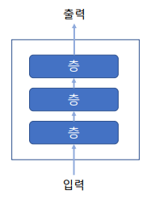
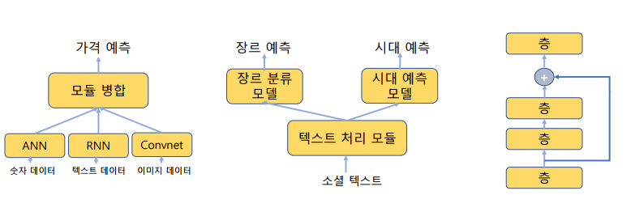
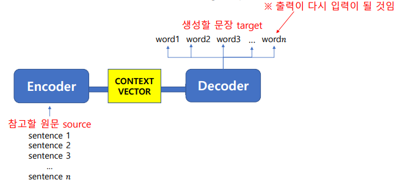
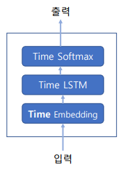
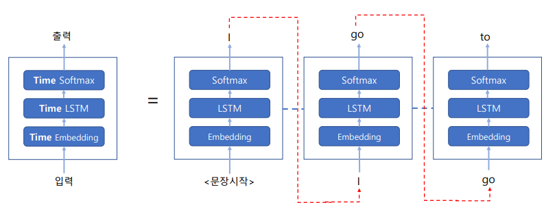
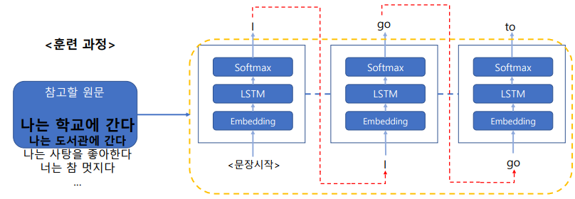
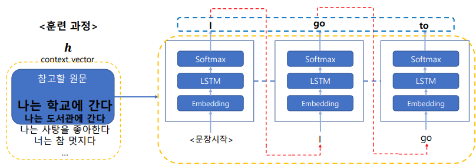
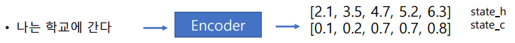
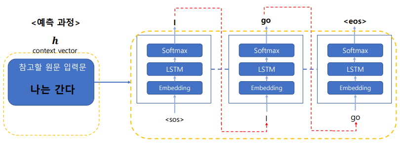
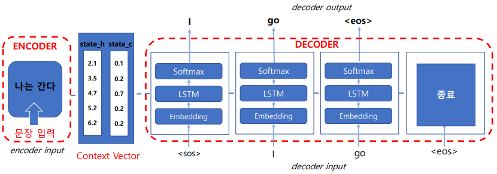

# 자연어생성 : seq2seq

## 함수형 API

- Sequential 모델은 네트워크의 입력과 출력이 하나라고 가정한다



- 함수형 API는 다중입력, 다중출력, 그래프 등 다양한 구조를 지원한다



## Sequential과 함수형 API 비교

- 단순한 모델로 Sequential과 Functional 을 비교한다
- Sequential 모델은 층을 하나하나 쌓아가면서 모델을 만드는 구조이다
- Functional API는 input에서 output으로 가는 과정을 설정하고, Model() 함수에 input과 output을 넣어 모델을 만드는 구조이다

### Sequential 형식 코드

```python
model = Sequential()
model.add(layers.Dense(32, activation='relu', input_shape=(64,)))
model.add(layers.Dense(32, activation='relu'))
model.add(layers.Dense(10, activation='softmax'))
```

### Functional API 형식 코드

```python
input_tensor    = Input(shape=(64,))
x = layers.Dense(32, activation='relu')(input_tensor) 
x = layers.Dense(32, activation='relu')(x)
output_tensor    = layers.Dense(10, activation='softmax')(x) 
model = Model(input_tensor, output_tensor)
```

## 번역모델

- 번역 모델은 두 개의 언어이므로 두 개의 입력이 필요하다
- 하나는 원문(source), 다른 하나는 그 때의 번역문(target input)이다



## 문장생성

- 문장을 생성하는 기본적인 방법은 다음과 같다


- “I go to a school”,  “I go to a library”와 같은 많은 문장을 훈련시킨다
- LSTM은 각 단어의 발생 확률을 단어의 순서에 따라 학습한다
- 위의 문장의 경우, “I” 뒤에는 “go”, “go” 뒤에는 “to”의 발생확률이 높을 것이다  


- 따라서 어떤 사람이 입력문의 시작으로 “I”를 넣으면
- LSTM은 망설이지 않고 “I go to a”까지를 자동으로 생성한다
- “go”를 넣으면 “go to a”를 자동 생성한다
- 그 뒤에 “school” 또는 “library”를 넣을지는 다른 분포를 더 봐야 한다



## 시계열 발생확률을 이용한 문장 생성

- 앞 타임스텝의 출력 결과로 다음 타임스텝에 발생할 단어를 예측한다



번역 모델을 훈련시킬 때
‘나는 학교에 간다’와 ‘I go to a school’ 두 개의 입력을 같이 훈련시킨다 

‘나는 학교에 간다’와 유사한 문장이 많을 때 (특정 Embedding 값에 대한 높은 빈도)  
입력된 문장이 ‘나는 학교에 간다’와 유사하다면 첫 문장의 시작은 출력으로 ‘I’가 나오도록 훈련된다  
계속, ‘나는 학교에 간다’ 類 문장에서 ‘I’ 단어 다음에는 ‘go’가 나오도록 훈련된다  
계속, ‘나는 학교에 간다’ 類 문장에서 ‘go’ 단어 다음에는 ‘to’가 나오도록 훈련된다

즉, 각 단어를 보고 단어 대 단어로 번역하는 것이 아니라, (그래서 두 언어 단어의 수와 순서는 관계없음) 문장을 자동 생성하되, 기존에 입력된 문장과 유사한 문장을 찾아 자동 생성하도록 훈련된다



훈련 과정에서는 번역문 출력 부분인 ‘I’, ‘go’, ‘to’, … 를 미리 알려준다  
즉, ‘나는 학교에 간다’ 類 문장이 오면 첫 시작은 ‘I’,  
‘나는 학교에 간다’ 類 문장에서 앞 단어 출력이 ‘I’이면 두 번째 단어 출력은 ‘go’,  
‘나는 학교에 간다’ 類 문장에서 앞 단어 출력이 ‘go’이면 다음 단어 출력은 ‘to’ 라고 알려주며 계속 훈련해 간다

번역 모델은 참고할 원문을 텍스트 형태로 가지고 있는 것이 아니라 숫자로 기호화된 벡터로 변환해 가지고 있다
이를 Context Vector 라고 한다



## Context Vector의 모습

- 원문은 Encoder를 거쳐 고정된 길이의 벡터로 출력된다

- 예) 나는 학교에 간다


예측 과정에서는 당연히 번역문의 출력이 무엇이 되어야 하는지 알려줄 수 없다  
단지 번역 대상인 원문만 가지고 예측을 진행한다

번역 대상 원문이 입력되면  
모델은 **숫자 벡터**로 변환된 원문 입력문과 시작 기호의 인덱스 값으로 문장 생성을 시작한다  
‘나는 학교에 간다’ 類 문장에서 문장의 첫 시작은 ‘I’를 출력하도록 훈련되었다  
‘나는 학교에 간다’ 類 문장에서 ‘I’ 다음에는 ‘go’가 출력되도록 훈련되었다  
‘나는 학교에 간다’ 類 문장에서 ‘go’ 다음에는 ‘to’가 출력되도록 훈련되었다

예측시 입력된 문장은 훈련시 입력된 문장들과는 조금씩은 다를 것이므로 출력 결과는 다른 단어로 잘못 출력될 수 있다

처음 시작은 시작 기호(예: &#60;sos&#62;, ‘\t’)를 입력하는 것으로 시작하여 종료 기호(예: &#60;eos&#62;, ‘\n’)가 예측 출력되면 문장 생성과정이 끝난다

* &#60;sos&#62; - start of sentence , &#60;eos&#62; = end of sentence



## 전체과정



* 입력 문장을 받아 부호화 하는 부분은 encoder  
숫자로 부호화된 것을 자연어로 출력하는 부분은 decoder

# seq2seq 실습

# seq2seq 기본자료

- seq2seq 기본 코드로 잘 알려진 프랑소아 숄레(케라스 개발자)의 코드를 기본으로 진행한다
- 음절 기반의 코드로서 word embedding은 사용하지 않는다
    - 음절 기반 : 점심 -> 시간 순으로 예측이 아니라 점->심->시->간 으로 예측,
    따라서 의미를 내포하고있는게 아니다
- 음절기반으로서 예측되는 형태의 종류는 제한적이다
- 음절 기반은 한 어절 내의 음절 연쇄를 예측하는 것이므로 어색한 어절이 만들어질 수 있다

## 데이터 확인


```python
path = "C:\\Users\\HongSungMin\\Desktop\\홍성민\\빅리더\\pytest\\data\\eng-kor\\"
```


```python
import pandas as pd
data = pd.read_csv(path+'eng-kor_small.txt', names=['source', 'target'], sep='\t', encoding='utf-8')
print('data length:', len(data))          
print('data type:', type(data))
print('data shape:', data.shape)
print('data sample:\n', data.sample(5))
```

    data length: 1000
    data type: <class 'pandas.core.frame.DataFrame'>
    data shape: (1000, 2)
    data sample:
                      source         target
    804  Come and see this.      와서 이것좀 봐.
    267         That hurts.            아파.
    784   Tom isn't skinny.    톰은 마르지 않았다.
    300        Come closer.         가까이 와.
    516      I'll kill him.  나는 그를 죽일 것이다.
    


```python
print('data.target length:', len(data.target))
print('data.target type:', type(data.target))
print('data.target shape:', data.target.shape)
print('data.target sample:\n', data.target.sample(5))
```

    data.target length: 1000
    data.target type: <class 'pandas.core.series.Series'>
    data.target shape: (1000,)
    data.target sample:
     2               뛰어!
    109           뭐 하러?
    920    난 이 학교를 좋아해.
    846    난 꽤 운이 좋았었어.
    189         누가 신경써?
    Name: target, dtype: object
    

## 시작부호와 종료부호 부착


```python
data.target_input = data.target.apply(lambda x : '\t'+x+'\n')
data.target_target = data.target.apply(lambda x : x+'\n')
print('\ndata.target_input:\n', data.target_input)
print('\ndata.target_target:\n', data.target_target)
```

    
    data.target_input:
     0                 \t가.\n
    1                \t안녕.\n
    2                \t뛰어!\n
    3                \t뛰어.\n
    4                \t누구?\n
                 ...        
    995     \t노래하는 거 좋아해요?\n
    996      \t노래하는 거 좋아해?\n
    997    \t고양이를 좋아하지 않아?\n
    998      \t꿈은 이루어질 거야.\n
    999     \t모두 그녀를 사랑한다.\n
    Name: target, Length: 1000, dtype: object
    
    data.target_target:
     0                 가.\n
    1                안녕.\n
    2                뛰어!\n
    3                뛰어.\n
    4                누구?\n
                ...       
    995     노래하는 거 좋아해요?\n
    996      노래하는 거 좋아해?\n
    997    고양이를 좋아하지 않아?\n
    998      꿈은 이루어질 거야.\n
    999     모두 그녀를 사랑한다.\n
    Name: target, Length: 1000, dtype: object
    

    C:\Users\HONGSU~1\AppData\Local\Temp/ipykernel_25100/2011925834.py:1: UserWarning: Pandas doesn't allow columns to be created via a new attribute name - see https://pandas.pydata.org/pandas-docs/stable/indexing.html#attribute-access
      data.target_input = data.target.apply(lambda x : '\t'+x+'\n')
    C:\Users\HONGSU~1\AppData\Local\Temp/ipykernel_25100/2011925834.py:2: UserWarning: Pandas doesn't allow columns to be created via a new attribute name - see https://pandas.pydata.org/pandas-docs/stable/indexing.html#attribute-access
      data.target_target = data.target.apply(lambda x : x+'\n')
    

* 참고 : 음절기반에서는 &#60;sos&#62;가 아닌 \t로 표시한다, 왜냐하면 &#60;sos&#62;도 5음절로 음절단위로 들어갈수가 없기 때문이다.

## 타입확인


```python
print('data.target_input length:', len(data.target_input))
print('data.target_input type:', type(data.target_input))
print('data.target_input shape:', data.target_input.shape)
print('data.target_input sample:\n', data.target_input.sample(5))
```

    data.target_input length: 1000
    data.target_input type: <class 'pandas.core.series.Series'>
    data.target_input shape: (1000,)
    data.target_input sample:
     238    \t난 기분이 나빴다.\n
    600      \t늦어서 미안해.\n
    196          \t조심해!\n
    538        \t그만 싸워!\n
    43            \t나가.\n
    Name: target, dtype: object
    

## 문장의 길이 maxlen 설정하기


```python
# Padding에 사용할 문장의 길이를 구한다. 여기서는 최대값으로 maxlen을 설정하였다 # source 문장의 최대 길이를 구한다
# source 문장의 최대 음절 길이로 maxlen을 설정
max_src_len = data.source.apply(lambda x: len(x)).max()
print('source sentence max length: ', max_src_len)  
# target 문장의 최대 길이를 구한다
# target 문장의 최대 음절 길이로 maxlen을 설정
max_tar_len = data.target_input.apply(lambda x: len(x)).max()-2 #sos와 eos가 추가되었기 때문에 2를 빼준다
print('target sentence max length: ', max_tar_len) 
```

    source sentence max length:  20
    target sentence max length:  19
    

## Data Tokenizing


```python
# 토크나이징으로 각 문자 종류에 숫자값을 배당한다
from keras.preprocessing.text import Tokenizer

# source 언어 Tokenizing
tokenizer_source = Tokenizer(num_words=None, char_level=True, lower=False)
tokenizer_source.fit_on_texts(data.source)    # 인덱스를 구축한다 
word_index_source = tokenizer_source.word_index # 글자와 인덱스의 쌍을 가져온다


word_index_source = tokenizer_source.word_index # 글자와 인덱스의 쌍을 가져온다
print('\n전체에서 %s개의 고유한 토큰을 찾았습니다.' % len(word_index_source))
print('word_index_source: ', word_index_source)
```

    
    전체에서 64개의 고유한 토큰을 찾았습니다.
    word_index_source:  {' ': 1, 'e': 2, 'o': 3, '.': 4, 'a': 5, 't': 6, 'i': 7, 's': 8, 'n': 9, 'r': 10, 'l': 11, 'd': 12, 'm': 13, 'h': 14, 'y': 15, 'u': 16, 'T': 17, 'g': 18, 'I': 19, 'c': 20, 'p': 21, 'w': 22, 'k': 23, "'": 24, 'v': 25, 'b': 26, 'f': 27, '?': 28, 'S': 29, '!': 30, 'W': 31, 'H': 32, 'C': 33, 'D': 34, 'E': 35, 'K': 36, 'A': 37, 'G': 38, 'Y': 39, 'N': 40, 'x': 41, 'F': 42, 'B': 43, 'L': 44, 'M': 45, 'q': 46, ',': 47, 'P': 48, 'R': 49, 'O': 50, 'z': 51, 'J': 52, 'j': 53, 'Q': 54, '-': 55, '7': 56, ':': 57, '4': 58, '5': 59, 'U': 60, '2': 61, '0': 62, '1': 63, '3': 64}
    


```python
# target 언어 Tokenizing
# target 언어의 Tokenizer도 target_input으로만 만들면 된다 (target의 output은 같은 언어이므로)
tokenizer_target = Tokenizer(num_words=None, char_level=True, lower=False)
tokenizer_target.fit_on_texts(data.target_input)         # 인덱스를 구축한다
word_index_target = tokenizer_target.word_index # 글자와 인덱스의 쌍을 가져온다
print('\n전체에서 %s개의 고유한 토큰을 찾았습니다.' % len(word_index_target)) 
print('word_index_target: ', word_index_target)
```

    
    전체에서 558개의 고유한 토큰을 찾았습니다.
    word_index_target:  {' ': 1, '\t': 2, '\n': 3, '.': 4, '어': 5, '이': 6, '톰': 7, '해': 8, '아': 9, '은': 10, '다': 11, '그': 12, '가': 13, '는': 14, '?': 15, '나': 16, '거': 17, '!': 18, '고': 19, '하': 20, '을': 21, '했': 22, '요': 23, '있': 24, '야': 25, '지': 26, '었': 27, '사': 28, '난': 29, '말': 30, '들': 31, '기': 32, '게': 33, '리': 34, '를': 35, '니': 36, '도': 37, '우': 38, '좋': 39, '와': 40, '내': 41, '에': 42, '람': 43, '무': 44, '자': 45, '마': 46, '서': 47, '봐': 48, '한': 49, '계': 50, '안': 51, '네': 52, '시': 53, '속': 54, '너': 55, '수': 56, '모': 57, '만': 58, '짓': 59, '라': 60, '두': 61, '누': 62, '일': 63, '세': 64, '정': 65, '웃': 66, '로': 67, '않': 68, '줘': 69, '았': 70, '제': 71, '렸': 72, '걸': 73, '없': 74, '려': 75, '물': 76, '미': 77, '저': 78, '여': 79, '건': 80, '죽': 81, '으': 82, '워': 83, '조': 84, '주': 85, '린': 86, '신': 87, '것': 88, '의': 89, '져': 90, '심': 91, '좀': 92, '운': 93, '인': 94, '구': 95, '진': 96, '렇': 97, '날': 98, '입': 99, '래': 100, '울': 101, '전': 102, '빨': 103, '피': 104, '히': 105, '할': 106, '보': 107, '러': 108, '파': 109, '소': 110, '양': 111, '대': 112, '발': 113, '질': 114, '용': 115, '부': 116, '생': 117, '졌': 118, '실': 119, '빠': 120, '녀': 121, '공': 122, '테': 123, '났': 124, '새': 125, '쳤': 126, '노': 127, '까': 128, '직': 129, '적': 130, '프': 131, '겼': 132, '왔': 133, '동': 134, '합': 135, '잘': 136, '버': 137, '떠': 138, '불': 139, '먹': 140, '비': 141, '군': 142, '혼': 143, '남': 144, '습': 145, '살': 146, '잠': 147, '작': 148, '알': 149, '절': 150, '장': 151, '되': 152, '늦': 153, '집': 154, '개': 155, '행': 156, '바': 157, '간': 158, '봤': 159, '열': 160, '오': 161, '돼': 162, '잊': 163, '눈': 164, '재': 165, '감': 166, '상': 167, '원': 168, '문': 169, '과': 170, '중': 171, '책': 172, '언': 173, '길': 174, '움': 175, '당': 176, '읽': 177, '경': 178, '참': 179, '스': 180, '쳐': 181, '웠': 182, '렀': 183, '복': 184, '성': 185, '짜': 186, '싫': 187, '름': 188, '화': 189, '늙': 190, '음': 191, '색': 192, '르': 193, '락': 194, '벽': 195, '얼': 196, '앉': 197, '믿': 198, '답': 199, '따': 200, '약': 201, '죄': 202, '번': 203, '타': 204, '천': 205, '선': 206, '키': 207, '랑': 208, '엄': 209, '춤': 210, '였': 211, '숨': 212, '쉬': 213, '차': 214, '넌': 215, '증': 216, '쟁': 217, '필': 218, '폐': 219, '머': 220, '명': 221, '디': 222, '녕': 223, '왜': 224, '연': 225, '슬': 226, '퍼': 227, '완': 228, '영': 229, '잡': 230, '잖': 231, '둘': 232, '둬': 233, '끝': 234, '켜': 235, '끔': 236, '찍': 237, '유': 238, '냄': 239, '분': 240, '침': 241, '돌': 242, '회': 243, '멋': 244, '골': 245, '괜': 246, '찮': 247, '킬': 248, '췄': 249, '싸': 250, '외': 251, '잤': 252, '평': 253, '돈': 254, '식': 255, '탁': 256, '굴': 257, '박': 258, '방': 259, '몰': 260, '독': 261, '배': 262, '느': 263, '싶': 264, '학': 265, '교': 266, '력': 267, '변': 268, '꿈': 269, '호': 270, '갈': 271, '뛰': 272, '쏴': 273, '점': 274, '격': 275, '때': 276, '끄': 277, '꺼': 278, '귀': 279, '못': 280, '크': 281, '뭐': 282, '밌': 283, '금': 284, '멈': 285, '춰': 286, '졸': 287, '쪽': 288, '반': 289, '걔': 290, '억': 291, '더': 292, '냈': 293, '줬': 294, '른': 295, '애': 296, '퇴': 297, '흥': 298, '놓': 299, '포': 300, '임': 301, '담': 302, '투': 303, '순': 304, '걱': 305, '든': 306, '강': 307, '많': 308, '받': 309, '찾': 310, '축': 311, '희': 312, '루': 313, '매': 314, '결': 315, '친': 316, '검': 317, '달': 318, '텐': 319, '후': 320, '샴': 321, '위': 322, '깐': 323, '볼': 324, '짝': 325, '설': 326, '환': 327, '엽': 328, '깊': 329, '빌': 330, '손': 331, '송': 332, '론': 333, '코': 334, '써': 335, '확': 336, '릴': 337, '존': 338, ',': 339, '빴': 340, '예': 341, '패': 342, '끙': 343, '국': 344, '데': 345, '떨': 346, '밍': 347, '옹': 348, '썼': 349, '익': 350, '갔': 351, '낄': 352, '치': 353, '틀': 354, '현': 355, '각': 356, '냥': 357, '추': 358, '땅': 359, '껴': 360, '덜': 361, '깨': 362, '엇': 363, '뭔': 364, '꽃': 365, '향': 366, '폭': 367, '드': 368, '섰': 369, '냐': 370, '단': 371, '큰': 372, '똑': 373, '끓': 374, '랩': 375, '꿔': 376, '초': 377, '꼈': 378, '례': 379, '판': 380, '창': 381, '같': 382, '찼': 383, '즉': 384, '뀌': 385, '카': 386, '샀': 387, '럽': 388, '밖': 389, '술': 390, '꽤': 391, '허': 392, '면': 393, '케': 394, '랐': 395, '런': 396, '꼼': 397, '겠': 398, '럴': 399, '굉': 400, '힘': 401, '흘': 402, '짖': 403, '준': 404, '쥐': 405, '7': 406, '4': 407, '5': 408, '죠': 409, '착': 410, '꾸': 411, '벅': 412, '뜨': 413, '왼': 414, '좌': 415, '얘': 416, '커': 417, '찌': 418, '뜻': 419, '쓰': 420, '옆': 421, '헉': 422, '댔': 423, '덕': 424, '품': 425, '활': 426, '맥': 427, '긴': 428, '충': 429, '최': 430, '란': 431, '별': 432, '종': 433, '찡': 434, '득': 435, '씩': 436, '씨': 437, '앓': 438, '셨': 439, '릎': 440, '꿇': 441, '쇠': 442, '붉': 443, '앞': 444, '령': 445, '숟': 446, '낡': 447, '흐': 448, '망': 449, '승': 450, '낙': 451, '싱': 452, '긋': 453, '빙': 454, '레': 455, '찔': 456, '궁': 457, '렁': 458, '렵': 459, '멀': 460, '쩡': 461, '듣': 462, '쓱': 463, '휘': 464, '병': 465, '겨': 466, '납': 467, '앙': 468, '긍': 469, '총': 470, '쨌': 471, '백': 472, '업': 473, '뭇': 474, '쪼': 475, '편': 476, '녹': 477, '티': 478, '켓': 479, '항': 480, '섭': 481, '처': 482, '랬': 483, '록': 484, '롭': 485, '목': 486, '삐': 487, '윤': 488, '잔': 489, '황': 490, '될': 491, '육': 492, '멍': 493, '청': 494, '꽉': 495, '표': 496, '겐': 497, '몇': 498, '십': 499, '셔': 500, '산': 501, '갰': 502, '갑': 503, '잃': 504, '농': 505, '체': 506, '관': 507, '뭘': 508, '딨': 509, '획': 510, '료': 511, '줄': 512, '낼': 513, '톱': 514, '곱': 515, '걷': 516, '흔': 517, '훔': 518, '널': 519, '취': 520, '철': 521, '극': 522, '낯': 523, '뿐': 524, '삶': 525, '짧': 526, '께': 527, '악': 528, '민': 529, '응': 530, '메': 531, '토': 532, '슨': 533, '욕': 534, '끼': 535, '앵': 536, '2': 537, '0': 538, '1': 539, '3': 540, '년': 541, '태': 542, '곧': 543, '닮': 544, '림': 545, '탓': 546, '옮': 547, '쉽': 548, '등': 549, '밤': 550, '끈': 551, '묶': 552, '월': 553, '깜': 554, '놀': 555, '쯤': 556, '올': 557, '컵': 558}
    

## Data Sequencing


```python
# 배당된 숫자를 이용하여 각 문장의 문자를 숫자로 치환한다 
# source 언어 Sequencing
encoder_input = tokenizer_source.texts_to_sequences(data.source)
print('\nResult of encoder_input sequencing: ')
print(data.source[0], encoder_input[0])
print(data.source[1], encoder_input[1])
print(data.source[2], encoder_input[2])
print(data.source[3], encoder_input[3])
```

    
    Result of encoder_input sequencing: 
    Go. [38, 3, 4]
    Hi. [32, 7, 4]
    Run! [49, 16, 9, 30]
    Run. [49, 16, 9, 4]
    


```python
# target 언어 Sequencing. input과 target에 같은 토크나이저 객체를 사용한다
decoder_input = tokenizer_target.texts_to_sequences(data.target_input)
decoder_target = tokenizer_target.texts_to_sequences(data.target_target)
print('\nResult of decoder_input sequencing: ')
print(data.target_input[0], decoder_input[0])
print(data.target_input[1], decoder_input[1])
print(data.target_input[2], decoder_input[2])
print('\nResult of decoder_target sequencing: ')
print(data.target_target[0], decoder_target[0])
print(data.target_target[1], decoder_target[1])
print(data.target_target[2], decoder_target[2])
```

    
    Result of decoder_input sequencing: 
    	가.
     [2, 13, 4, 3]
    	안녕.
     [2, 51, 223, 4, 3]
    	뛰어!
     [2, 272, 5, 18, 3]
    
    Result of decoder_target sequencing: 
    가.
     [13, 4, 3]
    안녕.
     [51, 223, 4, 3]
    뛰어!
     [272, 5, 18, 3]
    

## 타입확인


```python
# 토크나이징의 결과는 리스트 타입이다
print('data.source type:', type(data.source))              # Series
print('encoder_input type:', type(encoder_input))       # list
print('data.source:\n', data.source)
print('encoder_input\n:', encoder_input)
```

    data.source type: <class 'pandas.core.series.Series'>
    encoder_input type: <class 'list'>
    data.source:
     0                       Go.
    1                       Hi.
    2                      Run!
    3                      Run.
    4                      Who?
                   ...         
    995    Do you like singing?
    996    Do you like singing?
    997    Don't you like cats?
    998    Dreams do come true.
    999    Everybody loves her.
    Name: source, Length: 1000, dtype: object
    encoder_input
    : [[38, 3, 4], [32, 7, 4], [49, 16, 9, 30], [49, 16, 9, 4], [31, 14, 3, 28], [31, 3, 22, 30], [42, 7, 10, 2, 30], [32, 2, 11, 21, 30], [52, 16, 13, 21, 30], [52, 16, 13, 21, 4], [31, 5, 7, 6, 30], [31, 5, 7, 6, 30], [31, 5, 7, 6, 4], [43, 2, 18, 7, 9, 4], [32, 2, 11, 11, 3, 30], [19, 1, 8, 2, 2, 4], [19, 1, 6, 10, 15, 4], [19, 1, 22, 3, 9, 30], [50, 14, 1, 9, 3, 30], [49, 2, 11, 5, 41, 4], [29, 14, 3, 3, 6, 30], [29, 13, 7, 11, 2, 4], [37, 6, 6, 5, 20, 23, 30], [37, 6, 6, 5, 20, 23, 30], [42, 10, 2, 2, 51, 2, 30], [38, 2, 6, 1, 16, 21, 4], [38, 3, 6, 1, 7, 6, 30], [32, 16, 18, 1, 13, 2, 4], [19, 1, 23, 9, 3, 22, 4], [19, 1, 22, 3, 10, 23, 4], [44, 7, 8, 6, 2, 9, 4], [40, 3, 1, 22, 5, 15, 30], [40, 3, 1, 22, 5, 15, 30], [17, 14, 5, 9, 23, 8, 4], [31, 2, 1, 6, 10, 15, 4], [31, 2, 1, 22, 3, 9, 4], [31, 14, 15, 1, 13, 2, 28], [37, 22, 2, 8, 3, 13, 2, 30], [43, 2, 1, 27, 5, 7, 10, 4], [43, 2, 5, 6, 1, 7, 6, 4], [33, 5, 11, 11, 1, 16, 8, 4], [33, 3, 13, 2, 1, 7, 9, 4], [33, 3, 13, 2, 1, 3, 9, 30], [38, 2, 6, 1, 3, 16, 6, 4], [38, 3, 1, 5, 22, 5, 15, 30], [38, 3, 1, 5, 22, 5, 15, 4], [38, 3, 3, 12, 26, 15, 2, 30], [32, 2, 1, 20, 5, 13, 2, 4], [32, 2, 1, 20, 5, 13, 2, 4], [32, 2, 11, 21, 1, 13, 2, 30], [32, 2, 11, 21, 1, 13, 2, 4], [32, 7, 6, 1, 17, 3, 13, 4], [19, 1, 5, 18, 10, 2, 2, 4], [19, 24, 13, 1, 8, 5, 12, 4], [45, 2, 47, 1, 6, 3, 3, 4], [50, 21, 2, 9, 1, 16, 21, 4], [48, 2, 10, 27, 2, 20, 6, 30], [29, 14, 3, 22, 1, 13, 2, 4], [29, 14, 16, 6, 1, 16, 21, 30], [29, 23, 7, 21, 1, 7, 6, 4], [29, 6, 3, 21, 1, 7, 6, 4], [17, 2, 11, 11, 1, 13, 2, 4], [17, 3, 13, 1, 22, 3, 9, 4], [31, 5, 23, 2, 1, 16, 21, 30], [31, 5, 8, 14, 1, 16, 21, 4], [31, 2, 11, 20, 3, 13, 2, 4], [31, 2, 11, 20, 3, 13, 2, 4], [31, 14, 3, 1, 22, 3, 9, 28], [31, 14, 15, 1, 9, 3, 6, 28], [33, 14, 2, 2, 10, 1, 16, 21, 30], [33, 3, 3, 11, 1, 3, 27, 27, 30], [38, 2, 6, 1, 11, 3, 8, 6, 4], [38, 3, 1, 5, 14, 2, 5, 12, 4], [38, 3, 3, 12, 1, 53, 3, 26, 30], [38, 10, 5, 26, 1, 17, 3, 13, 4], [32, 3, 22, 1, 20, 16, 6, 2, 30], [32, 3, 22, 1, 20, 16, 6, 2, 30], [32, 3, 22, 1, 12, 2, 2, 21, 28], [32, 16, 10, 10, 15, 1, 16, 21, 4], [19, 1, 27, 3, 10, 18, 3, 6, 4], [19, 24, 13, 1, 16, 18, 11, 15, 4], [19, 6, 1, 14, 16, 10, 6, 8, 4], [19, 6, 1, 22, 3, 10, 23, 8, 4], [19, 6, 1, 22, 3, 10, 23, 8, 4], [19, 6, 1, 22, 3, 10, 23, 8, 4], [44, 2, 6, 24, 8, 1, 18, 3, 30], [44, 3, 3, 23, 1, 3, 16, 6, 30], [29, 7, 6, 1, 12, 3, 22, 9, 30], [29, 7, 6, 1, 14, 2, 10, 2, 4], [29, 21, 2, 5, 23, 1, 16, 21, 30], [29, 6, 5, 9, 12, 1, 16, 21, 30], [17, 2, 11, 11, 1, 17, 3, 13, 4], [17, 2, 11, 11, 1, 17, 3, 13, 4], [17, 14, 2, 15, 1, 22, 3, 9, 4], [17, 14, 2, 15, 1, 22, 3, 9, 4], [17, 3, 13, 1, 12, 7, 2, 12, 4], [17, 3, 13, 1, 11, 2, 27, 6, 4], [17, 3, 13, 1, 11, 2, 27, 6, 4], [17, 3, 13, 1, 11, 7, 2, 12, 4], [17, 3, 13, 1, 11, 7, 2, 12, 4], [17, 3, 13, 1, 11, 3, 8, 6, 4], [17, 3, 13, 1, 21, 5, 7, 12, 4], [17, 3, 13, 1, 46, 16, 7, 6, 4], [17, 3, 13, 1, 22, 2, 21, 6, 4], [17, 3, 3, 1, 11, 5, 6, 2, 4], [17, 10, 16, 8, 6, 1, 13, 2, 4], [17, 10, 15, 1, 14, 5, 10, 12, 4], [17, 10, 15, 1, 8, 3, 13, 2, 4], [17, 10, 15, 1, 6, 14, 7, 8, 4], [31, 14, 5, 6, 1, 27, 3, 10, 28], [31, 14, 5, 6, 1, 27, 16, 9, 30], [31, 14, 5, 6, 1, 27, 16, 9, 30], [31, 14, 3, 1, 12, 7, 2, 12, 28], [31, 14, 3, 1, 46, 16, 7, 6, 28], [37, 9, 8, 22, 2, 10, 1, 13, 2, 4], [43, 7, 10, 12, 8, 1, 27, 11, 15, 4], [33, 5, 11, 13, 1, 12, 3, 22, 9, 4], [33, 3, 13, 2, 1, 14, 2, 10, 2, 4], [33, 3, 13, 2, 1, 14, 3, 13, 2, 4], [34, 3, 18, 8, 1, 26, 5, 10, 23, 4], [34, 3, 9, 24, 6, 1, 11, 7, 2, 4], [34, 3, 9, 24, 6, 1, 11, 7, 2, 4], [42, 5, 9, 6, 5, 8, 6, 7, 20, 30], [42, 3, 11, 11, 3, 22, 1, 13, 2, 4], [42, 3, 10, 18, 2, 6, 1, 7, 6, 4], [42, 3, 10, 18, 2, 6, 1, 13, 2, 4], [42, 3, 10, 18, 2, 6, 1, 13, 2, 4], [38, 2, 6, 1, 10, 2, 5, 12, 15, 4], [38, 3, 3, 12, 1, 11, 16, 20, 23, 4], [38, 3, 3, 12, 1, 11, 16, 20, 23, 4], [38, 10, 5, 26, 1, 6, 14, 7, 8, 4], [32, 5, 9, 12, 8, 1, 3, 27, 27, 4], [32, 2, 1, 8, 13, 7, 11, 2, 12, 4], [32, 3, 11, 12, 1, 6, 14, 7, 8, 4], [32, 3, 22, 1, 5, 22, 27, 16, 11, 30], [32, 3, 22, 1, 5, 22, 27, 16, 11, 30], [19, 1, 27, 5, 7, 9, 6, 2, 12, 4], [19, 1, 11, 5, 16, 18, 14, 2, 12, 4], [19, 1, 21, 10, 3, 13, 7, 8, 2, 4], [19, 24, 13, 1, 8, 3, 10, 10, 15, 4], [19, 24, 13, 1, 8, 3, 10, 10, 15, 4], [19, 24, 13, 1, 8, 3, 10, 10, 15, 4], [19, 24, 13, 1, 8, 3, 10, 10, 15, 4], [19, 6, 1, 10, 5, 7, 9, 2, 12, 4], [19, 6, 1, 10, 5, 7, 9, 2, 12, 4], [19, 6, 1, 8, 9, 3, 22, 2, 12, 4], [19, 6, 1, 8, 6, 7, 9, 23, 8, 4], [19, 6, 24, 8, 1, 56, 57, 58, 59, 4], [36, 7, 11, 11, 1, 6, 14, 2, 13, 4], [44, 2, 5, 25, 2, 1, 9, 3, 22, 4], [50, 27, 1, 20, 3, 16, 10, 8, 2, 30], [50, 27, 1, 20, 3, 16, 10, 8, 2, 4], [50, 14, 1, 21, 11, 2, 5, 8, 2, 30], [49, 2, 5, 12, 1, 6, 14, 7, 8, 4], [29, 5, 15, 1, 14, 2, 11, 11, 3, 4], [29, 2, 2, 1, 26, 2, 11, 3, 22, 4], [29, 2, 10, 7, 3, 16, 8, 11, 15, 28], [29, 7, 6, 1, 6, 14, 2, 10, 2, 4], [29, 7, 6, 1, 6, 7, 18, 14, 6, 4], [29, 6, 5, 10, 6, 1, 9, 3, 22, 4], [29, 6, 5, 15, 1, 20, 5, 11, 13, 4], [29, 6, 5, 15, 1, 14, 2, 10, 2, 4], [29, 6, 2, 21, 1, 26, 5, 20, 23, 4], [29, 6, 3, 21, 1, 14, 2, 10, 2, 4], [17, 5, 23, 2, 1, 20, 5, 10, 2, 4], [17, 5, 23, 2, 1, 6, 14, 7, 8, 4], [17, 5, 23, 2, 1, 6, 14, 7, 8, 4], [17, 5, 23, 2, 1, 6, 14, 7, 8, 4], [17, 14, 5, 9, 23, 1, 15, 3, 16, 4], [17, 14, 2, 9, 1, 22, 14, 5, 6, 28], [17, 14, 2, 15, 1, 11, 2, 27, 6, 4], [17, 14, 2, 15, 1, 11, 2, 27, 6, 4], [17, 14, 2, 15, 1, 11, 2, 27, 6, 4], [17, 14, 2, 15, 1, 11, 7, 2, 12, 4], [17, 14, 2, 15, 1, 11, 3, 8, 6, 4], [17, 14, 2, 15, 1, 11, 3, 8, 6, 4], [17, 3, 13, 1, 20, 10, 7, 2, 12, 4], [17, 3, 13, 1, 12, 3, 51, 2, 12, 4], [17, 3, 13, 1, 12, 10, 3, 25, 2, 4], [17, 3, 13, 1, 23, 9, 7, 6, 8, 4], [17, 3, 13, 1, 23, 9, 3, 22, 8, 4], [17, 10, 15, 1, 5, 18, 5, 7, 9, 4], [17, 16, 10, 9, 1, 11, 2, 27, 6, 4], [17, 16, 10, 9, 1, 11, 2, 27, 6, 4], [31, 5, 7, 6, 1, 14, 2, 10, 2, 4], [31, 5, 6, 20, 14, 1, 3, 16, 6, 30], [31, 2, 1, 6, 5, 11, 23, 2, 12, 4], [31, 2, 1, 22, 5, 7, 6, 2, 12, 4], [31, 2, 11, 11, 1, 12, 3, 9, 2, 30], [31, 14, 3, 1, 20, 5, 10, 2, 8, 28], [31, 14, 3, 1, 23, 9, 3, 22, 8, 28], [31, 3, 9, 12, 2, 10, 27, 16, 11, 30], [39, 3, 16, 1, 7, 12, 7, 3, 6, 30], [39, 3, 16, 1, 6, 10, 7, 2, 12, 4], [37, 11, 11, 1, 5, 26, 3, 5, 10, 12, 30], [37, 8, 23, 1, 5, 9, 15, 3, 9, 2, 4], [43, 2, 1, 20, 5, 10, 2, 27, 16, 11, 4], [43, 2, 1, 21, 5, 6, 7, 2, 9, 6, 4], [43, 2, 1, 21, 5, 6, 7, 2, 9, 6, 4], [43, 7, 10, 12, 8, 1, 8, 7, 9, 18, 4], [43, 10, 7, 9, 18, 1, 22, 7, 9, 2, 4], [43, 10, 7, 9, 18, 1, 22, 7, 9, 2, 4], [33, 5, 10, 10, 15, 1, 6, 14, 7, 8, 4], [33, 5, 10, 10, 15, 1, 6, 14, 7, 8, 4], [33, 14, 2, 20, 23, 1, 6, 14, 7, 8, 4], [33, 14, 3, 3, 8, 2, 1, 3, 9, 2, 4], [33, 3, 13, 2, 1, 5, 18, 5, 7, 9, 4], [33, 3, 13, 2, 1, 5, 11, 3, 9, 2, 4], [33, 3, 13, 2, 1, 5, 11, 3, 9, 18, 4], [33, 3, 13, 2, 1, 46, 16, 7, 20, 23, 30], [34, 2, 27, 7, 9, 7, 6, 2, 11, 15, 30], [34, 3, 9, 24, 6, 1, 6, 5, 11, 23, 30], [35, 5, 6, 1, 8, 11, 3, 22, 11, 15, 4], [42, 5, 20, 2, 1, 27, 5, 20, 6, 8, 30], [42, 7, 10, 2, 1, 26, 16, 10, 9, 8, 4], [42, 3, 11, 11, 3, 22, 1, 14, 7, 13, 4], [42, 3, 10, 18, 2, 6, 1, 17, 3, 13, 4], [42, 3, 10, 18, 2, 6, 1, 14, 7, 13, 4], [42, 3, 10, 18, 7, 25, 2, 1, 13, 2, 4], [42, 3, 10, 18, 7, 25, 2, 1, 16, 8, 4], [42, 3, 10, 18, 7, 25, 2, 1, 16, 8, 4], [38, 3, 12, 1, 2, 41, 7, 8, 6, 8, 4], [32, 2, 1, 7, 8, 1, 9, 7, 20, 2, 4], [32, 2, 1, 7, 8, 1, 6, 5, 11, 11, 4], [32, 2, 15, 47, 1, 10, 2, 11, 5, 41, 4], [32, 3, 11, 12, 1, 8, 6, 7, 11, 11, 4], [32, 3, 11, 12, 1, 8, 6, 7, 11, 11, 4], [32, 3, 22, 1, 11, 3, 25, 2, 11, 15, 30], [32, 3, 22, 1, 6, 10, 5, 18, 7, 20, 30], [32, 3, 22, 1, 6, 10, 5, 18, 7, 20, 30], [32, 3, 22, 24, 8, 1, 22, 3, 10, 23, 28], [32, 3, 22, 24, 8, 1, 22, 3, 10, 23, 28], [32, 16, 10, 10, 15, 1, 26, 5, 20, 23, 4], [19, 1, 5, 13, 1, 14, 16, 13, 5, 9, 4], [19, 1, 20, 14, 16, 20, 23, 11, 2, 12, 4], [19, 1, 12, 7, 8, 5, 18, 10, 2, 2, 4], [19, 1, 2, 9, 25, 15, 1, 14, 7, 13, 4], [19, 1, 2, 9, 25, 15, 1, 15, 3, 16, 4], [19, 1, 27, 2, 11, 6, 1, 26, 5, 12, 4], [19, 1, 10, 2, 13, 2, 13, 26, 2, 10, 4], [19, 1, 22, 5, 9, 6, 1, 17, 3, 13, 4], [19, 18, 9, 3, 10, 2, 1, 17, 3, 13, 4], [19, 18, 9, 3, 10, 2, 1, 14, 7, 13, 4], [19, 8, 1, 17, 3, 13, 1, 7, 11, 11, 28], [19, 8, 1, 6, 14, 5, 6, 1, 50, 36, 28], [19, 6, 1, 7, 8, 1, 22, 5, 10, 13, 4], [36, 2, 2, 21, 1, 18, 3, 7, 9, 18, 4], [36, 2, 2, 21, 1, 46, 16, 7, 2, 6, 4], [36, 2, 2, 21, 1, 8, 6, 7, 11, 11, 4], [44, 2, 6, 1, 13, 2, 1, 12, 7, 2, 4], [44, 3, 3, 23, 1, 6, 14, 2, 10, 2, 4], [44, 3, 25, 2, 1, 14, 16, 10, 6, 8, 4], [45, 5, 13, 5, 1, 20, 10, 7, 2, 12, 4], [45, 5, 13, 5, 1, 20, 10, 7, 2, 12, 4], [40, 2, 25, 2, 10, 1, 13, 7, 9, 12, 30], [40, 3, 1, 20, 3, 13, 13, 2, 9, 6, 4], [40, 3, 1, 21, 10, 3, 26, 11, 2, 13, 30], [50, 9, 20, 2, 1, 5, 18, 5, 7, 9, 4], [48, 11, 2, 5, 8, 2, 1, 8, 7, 6, 4], [48, 11, 2, 5, 8, 2, 1, 8, 7, 6, 4], [54, 16, 7, 2, 6, 1, 12, 3, 22, 9, 4], [29, 7, 9, 18, 1, 5, 11, 3, 9, 18, 4], [29, 6, 5, 10, 6, 1, 14, 2, 10, 2, 4], [29, 6, 5, 10, 6, 1, 3, 25, 2, 10, 4], [29, 6, 2, 21, 1, 5, 8, 7, 12, 2, 4], [29, 6, 3, 21, 1, 11, 15, 7, 9, 18, 4], [29, 6, 16, 12, 15, 1, 14, 5, 10, 12, 4], [17, 14, 5, 6, 1, 14, 16, 10, 6, 8, 4], [17, 14, 5, 6, 1, 14, 16, 10, 6, 8, 4], [17, 3, 13, 1, 5, 18, 10, 2, 2, 12, 4], [17, 3, 13, 1, 20, 14, 2, 5, 6, 8, 4], [17, 3, 13, 1, 12, 5, 9, 20, 2, 12, 4], [17, 3, 13, 1, 12, 10, 7, 25, 2, 8, 4], [17, 3, 13, 1, 27, 5, 7, 11, 2, 12, 4], [17, 3, 13, 1, 27, 3, 10, 18, 3, 6, 4], [17, 3, 13, 1, 27, 3, 16, 18, 14, 6, 4], [17, 3, 13, 1, 18, 5, 8, 21, 2, 12, 4], [17, 3, 13, 1, 14, 2, 11, 21, 2, 12, 4], [17, 3, 13, 1, 53, 16, 13, 21, 2, 12, 4], [17, 3, 13, 1, 11, 3, 3, 23, 2, 12, 4], [17, 3, 13, 1, 13, 3, 5, 9, 2, 12, 4], [17, 3, 13, 1, 9, 3, 12, 12, 2, 12, 4], [17, 3, 13, 1, 8, 7, 18, 14, 2, 12, 4], [17, 3, 13, 1, 8, 13, 7, 11, 2, 12, 4], [17, 3, 13, 1, 8, 9, 3, 10, 2, 8, 4], [17, 3, 13, 1, 22, 5, 7, 6, 2, 12, 4], [17, 3, 13, 1, 15, 5, 22, 9, 2, 12, 4], [17, 16, 10, 9, 1, 10, 7, 18, 14, 6, 4], [17, 16, 10, 9, 1, 10, 7, 18, 14, 6, 4], [39, 3, 16, 1, 20, 5, 11, 11, 2, 12, 28], [39, 3, 16, 1, 20, 5, 11, 11, 2, 12, 28], [39, 3, 16, 1, 12, 2, 20, 7, 12, 2, 4], [37, 9, 15, 3, 9, 2, 1, 14, 3, 13, 2, 28], [37, 9, 15, 3, 9, 2, 1, 14, 16, 10, 6, 28], [43, 2, 1, 20, 14, 2, 2, 10, 27, 16, 11, 4], [43, 2, 1, 15, 3, 16, 10, 8, 2, 11, 27, 4], [43, 2, 1, 15, 3, 16, 10, 8, 2, 11, 27, 4], [43, 3, 15, 8, 1, 12, 3, 1, 20, 10, 15, 4], [33, 14, 2, 20, 23, 1, 5, 18, 5, 7, 9, 4], [33, 3, 13, 2, 1, 5, 26, 3, 5, 10, 12, 4], [33, 3, 13, 2, 1, 20, 11, 3, 8, 2, 10, 4], [33, 3, 13, 2, 1, 7, 9, 8, 7, 12, 2, 4], [42, 7, 9, 7, 8, 14, 1, 6, 14, 7, 8, 4], [38, 2, 6, 1, 8, 2, 10, 7, 3, 16, 8, 4], [32, 2, 1, 20, 14, 16, 20, 23, 11, 2, 12, 4], [32, 2, 1, 10, 2, 8, 7, 18, 9, 2, 12, 4], [32, 3, 22, 1, 20, 16, 10, 7, 3, 16, 8, 30], [32, 3, 22, 1, 8, 6, 10, 5, 9, 18, 2, 30], [19, 1, 12, 3, 9, 24, 6, 1, 11, 7, 2, 4], [19, 1, 12, 3, 9, 24, 6, 1, 11, 7, 2, 4], [19, 1, 12, 3, 9, 24, 6, 1, 11, 7, 2, 4], [19, 1, 2, 41, 2, 10, 20, 7, 8, 2, 12, 4], [19, 1, 11, 7, 23, 2, 1, 26, 2, 2, 10, 4], [19, 1, 3, 25, 2, 10, 8, 11, 2, 21, 6, 4], [19, 24, 13, 1, 9, 2, 10, 25, 3, 16, 8, 4], [19, 24, 13, 1, 9, 2, 10, 25, 3, 16, 8, 4], [19, 24, 13, 1, 8, 14, 3, 20, 23, 2, 12, 4], [19, 18, 9, 3, 10, 2, 1, 6, 14, 5, 6, 4], [19, 6, 24, 8, 1, 5, 1, 21, 7, 6, 15, 4], [19, 6, 24, 8, 1, 16, 9, 27, 5, 7, 10, 4], [36, 2, 2, 21, 1, 13, 3, 25, 7, 9, 18, 4], [36, 2, 2, 21, 1, 6, 10, 15, 7, 9, 18, 4], [44, 3, 3, 23, 1, 5, 10, 3, 16, 9, 12, 4], [45, 3, 9, 2, 15, 1, 6, 5, 11, 23, 8, 4], [45, 15, 1, 12, 3, 18, 1, 12, 7, 2, 12, 4], [40, 7, 20, 2, 1, 6, 7, 13, 7, 9, 18, 4], [40, 7, 20, 2, 1, 6, 7, 13, 7, 9, 18, 4], [40, 3, 26, 3, 12, 15, 1, 20, 5, 13, 2, 4], [40, 3, 26, 3, 12, 15, 1, 12, 7, 2, 12, 4], [40, 3, 26, 3, 12, 15, 1, 12, 7, 2, 12, 4], [40, 3, 26, 3, 12, 15, 1, 11, 7, 2, 12, 4], [40, 3, 26, 3, 12, 15, 1, 11, 7, 2, 12, 4], [48, 11, 5, 9, 6, 8, 1, 18, 10, 3, 22, 4], [48, 11, 2, 5, 8, 2, 1, 8, 7, 9, 18, 4], [48, 11, 2, 5, 8, 2, 1, 8, 6, 5, 15, 4], [48, 11, 2, 5, 8, 2, 1, 8, 6, 3, 21, 4], [49, 2, 11, 2, 5, 8, 2, 1, 14, 7, 13, 4], [49, 2, 11, 2, 5, 8, 2, 1, 14, 7, 13, 4], [49, 2, 13, 2, 13, 26, 2, 10, 1, 7, 6, 4], [29, 5, 15, 1, 18, 3, 3, 12, 26, 15, 2, 4], [29, 5, 15, 1, 9, 3, 6, 14, 7, 9, 18, 4], [29, 6, 3, 21, 1, 20, 10, 15, 7, 9, 18, 4], [29, 6, 3, 21, 1, 13, 3, 25, 7, 9, 18, 30], [17, 14, 2, 15, 1, 12, 5, 9, 20, 2, 12, 4], [17, 14, 2, 15, 1, 12, 5, 9, 20, 2, 12, 4], [17, 14, 2, 15, 1, 14, 16, 18, 18, 2, 12, 4], [17, 14, 2, 15, 1, 23, 7, 8, 8, 2, 12, 4], [17, 14, 2, 15, 1, 3, 26, 2, 15, 2, 12, 4], [17, 14, 2, 15, 1, 8, 13, 7, 11, 2, 12, 4], [17, 14, 2, 15, 1, 8, 13, 7, 11, 2, 12, 4], [17, 3, 13, 1, 26, 11, 16, 8, 14, 2, 12, 4], [17, 3, 13, 1, 20, 14, 2, 5, 6, 2, 12, 4], [17, 3, 13, 1, 20, 14, 2, 5, 6, 2, 12, 4], [17, 3, 13, 1, 20, 11, 5, 21, 21, 2, 12, 4], [17, 3, 13, 1, 20, 11, 5, 21, 21, 2, 12, 4], [17, 3, 13, 1, 20, 3, 16, 18, 14, 2, 12, 4], [17, 3, 13, 1, 12, 10, 3, 22, 9, 2, 12, 4], [17, 3, 13, 1, 12, 10, 3, 22, 9, 2, 12, 4], [17, 3, 13, 1, 2, 8, 20, 5, 21, 2, 12, 4], [17, 3, 13, 1, 2, 8, 20, 5, 21, 2, 12, 4], [17, 3, 13, 1, 2, 41, 14, 5, 11, 2, 12, 4], [17, 3, 13, 1, 2, 41, 14, 5, 11, 2, 12, 4], [17, 3, 13, 1, 27, 5, 7, 9, 6, 2, 12, 4], [17, 3, 13, 1, 27, 10, 3, 22, 9, 2, 12, 4], [17, 3, 13, 1, 18, 7, 18, 18, 11, 2, 12, 4], [17, 3, 13, 1, 18, 7, 18, 18, 11, 2, 12, 4], [17, 3, 13, 1, 18, 7, 18, 18, 11, 2, 12, 4], [17, 3, 13, 1, 18, 10, 7, 9, 9, 2, 12, 4], [17, 3, 13, 1, 18, 10, 7, 9, 9, 2, 12, 4], [17, 3, 13, 1, 18, 10, 3, 5, 9, 2, 12, 4], [17, 3, 13, 1, 7, 9, 14, 5, 11, 2, 12, 4], [17, 3, 13, 1, 7, 8, 1, 8, 7, 20, 23, 4], [17, 3, 13, 1, 23, 9, 2, 2, 11, 2, 12, 4], [17, 3, 13, 1, 11, 5, 16, 18, 14, 2, 12, 4], [17, 3, 13, 24, 8, 1, 11, 15, 7, 9, 18, 4], [17, 16, 10, 9, 1, 5, 10, 3, 16, 9, 12, 4], [31, 5, 11, 23, 1, 8, 11, 3, 22, 11, 15, 4], [31, 5, 8, 1, 19, 1, 22, 10, 3, 9, 18, 28], [31, 2, 1, 21, 10, 3, 13, 7, 8, 2, 12, 4], [31, 2, 1, 10, 2, 13, 2, 13, 26, 2, 10, 4], [31, 2, 1, 8, 16, 10, 25, 7, 25, 2, 12, 30], [31, 14, 5, 6, 24, 8, 1, 6, 14, 5, 6, 28], [31, 3, 10, 23, 1, 8, 11, 3, 22, 11, 15, 4], [39, 3, 16, 24, 10, 2, 1, 13, 7, 9, 2, 4], [39, 3, 16, 24, 10, 2, 1, 13, 7, 9, 2, 4], [37, 9, 15, 26, 3, 12, 15, 1, 14, 2, 10, 2, 28], [37, 9, 15, 26, 3, 12, 15, 1, 14, 3, 13, 2, 28], [37, 9, 15, 26, 3, 12, 15, 1, 14, 3, 13, 2, 28], [37, 9, 15, 26, 3, 12, 15, 1, 14, 16, 10, 6, 28], [37, 9, 15, 6, 14, 7, 9, 18, 1, 9, 2, 22, 28], [43, 2, 1, 10, 2, 5, 11, 7, 8, 6, 7, 20, 30], [43, 2, 2, 27, 47, 1, 21, 11, 2, 5, 8, 2, 4], [43, 11, 3, 3, 12, 1, 7, 8, 1, 10, 2, 12, 4], [33, 5, 9, 1, 19, 1, 18, 3, 1, 9, 3, 22, 28], [33, 3, 13, 2, 1, 27, 3, 10, 22, 5, 10, 12, 4], [33, 3, 13, 2, 1, 46, 16, 7, 20, 23, 11, 15, 30], [33, 3, 13, 2, 1, 46, 16, 7, 20, 23, 11, 15, 30], [34, 3, 9, 24, 6, 1, 2, 5, 6, 1, 7, 6, 4], [34, 10, 7, 25, 2, 1, 27, 5, 8, 6, 2, 10, 4], [35, 41, 5, 13, 7, 9, 2, 1, 6, 14, 2, 13, 4], [35, 41, 5, 13, 7, 9, 2, 1, 6, 14, 7, 8, 4], [42, 7, 8, 14, 47, 1, 21, 11, 2, 5, 8, 2, 4], [38, 14, 3, 8, 6, 8, 1, 2, 41, 7, 8, 6, 4], [38, 10, 5, 26, 1, 5, 1, 8, 21, 3, 3, 9, 4], [32, 2, 1, 8, 16, 20, 20, 2, 2, 12, 2, 12, 4], [32, 3, 22, 1, 5, 9, 9, 3, 15, 7, 9, 18, 30], [32, 3, 22, 1, 5, 9, 9, 3, 15, 7, 9, 18, 30], [32, 3, 22, 1, 5, 10, 10, 3, 18, 5, 9, 6, 30], [32, 3, 22, 1, 14, 3, 10, 10, 7, 26, 11, 2, 30], [19, 1, 5, 21, 3, 11, 3, 18, 7, 51, 2, 12, 4], [19, 1, 12, 3, 9, 24, 6, 1, 23, 9, 3, 22, 4], [19, 1, 14, 5, 6, 2, 1, 11, 7, 5, 10, 8, 4], [19, 1, 9, 2, 2, 12, 1, 13, 3, 9, 2, 15, 4], [19, 1, 16, 9, 12, 2, 10, 8, 6, 5, 9, 12, 4], [19, 1, 16, 9, 12, 2, 10, 8, 6, 3, 3, 12, 4], [19, 24, 13, 1, 5, 12, 12, 7, 20, 6, 2, 12, 4], [19, 24, 13, 1, 26, 11, 2, 2, 12, 7, 9, 18, 4], [19, 8, 1, 6, 14, 5, 6, 1, 3, 23, 5, 15, 28], [19, 8, 1, 6, 14, 7, 8, 1, 13, 7, 9, 2, 28], [19, 8, 1, 6, 14, 7, 8, 1, 22, 7, 9, 2, 28], [19, 6, 24, 11, 11, 1, 26, 2, 1, 14, 3, 6, 4], [19, 6, 24, 8, 1, 8, 9, 3, 22, 7, 9, 18, 4], [19, 6, 24, 8, 1, 8, 16, 7, 20, 7, 12, 2, 4], [19, 6, 24, 8, 1, 6, 3, 3, 1, 3, 11, 12, 4], [19, 6, 24, 8, 1, 6, 3, 3, 1, 3, 11, 12, 4], [52, 16, 8, 6, 1, 23, 2, 2, 21, 1, 7, 6, 4], [36, 2, 2, 21, 1, 12, 5, 9, 20, 7, 9, 18, 4], [36, 2, 2, 21, 1, 12, 5, 9, 20, 7, 9, 18, 4], [36, 2, 2, 21, 1, 12, 7, 18, 18, 7, 9, 18, 4], [36, 2, 2, 21, 1, 12, 7, 18, 18, 7, 9, 18, 4], [36, 2, 2, 21, 1, 12, 10, 7, 25, 7, 9, 18, 4], [36, 2, 2, 21, 1, 27, 3, 20, 16, 8, 2, 12, 4], [36, 2, 2, 21, 1, 11, 3, 3, 23, 7, 9, 18, 4], [36, 2, 2, 21, 1, 10, 2, 5, 12, 7, 9, 18, 4], [36, 2, 2, 21, 1, 8, 7, 9, 18, 7, 9, 18, 4], [36, 2, 2, 21, 1, 8, 7, 9, 18, 7, 9, 18, 4], [36, 2, 2, 21, 1, 8, 13, 7, 11, 7, 9, 18, 4], [36, 2, 2, 21, 1, 8, 13, 7, 11, 7, 9, 18, 4], [36, 2, 2, 21, 1, 8, 13, 7, 11, 7, 9, 18, 4], [36, 2, 2, 21, 1, 6, 5, 11, 23, 7, 9, 18, 4], [36, 2, 2, 21, 1, 6, 5, 11, 23, 7, 9, 18, 4], [45, 3, 25, 2, 1, 46, 16, 7, 2, 6, 11, 15, 4], [40, 3, 26, 3, 12, 15, 1, 5, 8, 23, 2, 12, 4], [40, 3, 26, 3, 12, 15, 1, 23, 9, 3, 22, 8, 4], [48, 11, 2, 5, 8, 2, 1, 14, 16, 10, 10, 15, 4], [48, 11, 2, 5, 8, 2, 1, 11, 2, 5, 25, 2, 4], [48, 11, 2, 5, 8, 2, 1, 10, 2, 11, 5, 41, 4], [48, 11, 2, 5, 8, 2, 1, 8, 13, 7, 11, 2, 4], [29, 14, 2, 1, 22, 5, 8, 1, 26, 16, 8, 15, 4], [29, 3, 13, 2, 3, 9, 2, 1, 20, 5, 13, 2, 4], [29, 6, 3, 21, 1, 10, 2, 5, 12, 7, 9, 18, 4], [29, 6, 3, 21, 1, 8, 13, 3, 23, 7, 9, 18, 4], [29, 6, 3, 21, 1, 8, 6, 5, 10, 7, 9, 18, 4], [29, 6, 3, 21, 1, 6, 5, 11, 23, 7, 9, 18, 4], [29, 6, 3, 21, 1, 22, 14, 7, 9, 7, 9, 18, 4], [29, 6, 3, 21, 1, 15, 2, 11, 11, 7, 9, 18, 30], [17, 14, 2, 15, 1, 2, 8, 20, 5, 21, 2, 12, 4], [17, 14, 2, 15, 1, 11, 5, 16, 18, 14, 2, 12, 4], [17, 14, 2, 15, 1, 10, 2, 27, 16, 8, 2, 12, 4], [17, 14, 2, 15, 1, 10, 2, 11, 5, 41, 2, 12, 4], [17, 3, 13, 1, 5, 9, 8, 22, 2, 10, 2, 12, 4], [17, 3, 13, 1, 5, 21, 21, 10, 3, 25, 2, 12, 4], [17, 3, 13, 1, 20, 14, 16, 20, 23, 11, 2, 12, 4], [17, 3, 13, 1, 20, 14, 16, 20, 23, 11, 2, 12, 4], [17, 3, 13, 1, 2, 9, 11, 7, 8, 6, 2, 12, 4], [17, 3, 13, 1, 27, 7, 9, 7, 8, 14, 2, 12, 4], [17, 3, 13, 1, 27, 11, 7, 9, 20, 14, 2, 12, 4], [17, 3, 13, 1, 18, 10, 16, 13, 26, 11, 2, 12, 4], [17, 3, 13, 1, 18, 10, 16, 13, 26, 11, 2, 12, 4], [17, 3, 13, 1, 7, 9, 8, 7, 8, 6, 2, 12, 4], [17, 3, 13, 1, 7, 8, 1, 2, 5, 18, 2, 10, 4], [17, 3, 13, 1, 7, 8, 1, 46, 16, 7, 20, 23, 4], [17, 3, 13, 1, 7, 8, 1, 46, 16, 7, 20, 23, 4], [17, 3, 13, 1, 7, 8, 1, 8, 7, 11, 11, 15, 4], [17, 3, 13, 1, 7, 8, 1, 8, 3, 26, 2, 10, 4], [17, 3, 13, 1, 7, 8, 1, 8, 3, 26, 2, 10, 4], [17, 3, 13, 1, 11, 7, 8, 6, 2, 9, 2, 12, 4], [17, 3, 13, 1, 8, 14, 10, 16, 18, 18, 2, 12, 4], [17, 3, 13, 1, 22, 14, 7, 8, 6, 11, 2, 12, 4], [60, 9, 26, 2, 11, 7, 2, 25, 5, 26, 11, 2, 30], [31, 2, 1, 5, 21, 3, 11, 3, 18, 7, 51, 2, 4], [31, 2, 1, 12, 3, 9, 24, 6, 1, 11, 7, 2, 4], [31, 2, 1, 12, 3, 9, 24, 6, 1, 11, 7, 2, 4], [31, 2, 1, 3, 25, 2, 10, 8, 11, 2, 21, 6, 4], [31, 2, 1, 8, 16, 20, 20, 2, 2, 12, 2, 12, 4], [31, 2, 1, 8, 16, 20, 20, 2, 2, 12, 2, 12, 4], [31, 2, 24, 10, 2, 1, 7, 9, 8, 7, 12, 2, 4], [31, 2, 24, 10, 2, 1, 7, 9, 8, 7, 12, 2, 4], [31, 2, 11, 20, 3, 13, 2, 1, 26, 5, 20, 23, 4], [31, 2, 11, 20, 3, 13, 2, 1, 14, 3, 13, 2, 4], [31, 14, 5, 6, 1, 7, 8, 1, 6, 14, 5, 6, 28], [37, 9, 15, 1, 46, 16, 2, 8, 6, 7, 3, 9, 8, 28], [37, 9, 15, 1, 46, 16, 2, 8, 6, 7, 3, 9, 8, 28], [33, 5, 9, 1, 19, 1, 5, 8, 23, 1, 22, 14, 15, 28], [33, 5, 6, 8, 1, 5, 10, 2, 1, 20, 16, 6, 2, 4], [33, 3, 13, 2, 1, 6, 3, 13, 3, 10, 10, 3, 22, 4], [35, 5, 6, 1, 8, 3, 13, 2, 6, 14, 7, 9, 18, 4], [35, 25, 2, 10, 15, 3, 9, 2, 1, 12, 7, 2, 8, 4], [42, 11, 3, 22, 2, 10, 8, 1, 26, 11, 3, 3, 13, 4], [38, 10, 5, 26, 1, 6, 14, 2, 1, 10, 3, 21, 2, 4], [32, 2, 24, 8, 1, 5, 16, 6, 7, 8, 6, 7, 20, 4], [32, 3, 22, 1, 26, 2, 5, 16, 6, 7, 27, 16, 11, 30], [32, 3, 22, 1, 22, 3, 9, 12, 2, 10, 27, 16, 11, 30], [19, 1, 5, 13, 1, 14, 3, 13, 2, 8, 7, 20, 23, 4], [19, 1, 20, 5, 9, 24, 6, 1, 8, 11, 2, 2, 21, 4], [19, 1, 27, 2, 2, 11, 1, 18, 16, 7, 11, 6, 15, 4], [19, 1, 27, 2, 2, 11, 1, 11, 3, 9, 2, 11, 15, 4], [19, 1, 18, 3, 6, 1, 2, 9, 18, 5, 18, 2, 12, 4], [19, 1, 14, 5, 6, 2, 1, 13, 15, 8, 2, 11, 27, 4], [19, 1, 11, 7, 23, 2, 1, 14, 3, 10, 8, 2, 8, 4], [19, 1, 11, 7, 23, 2, 1, 22, 7, 9, 6, 2, 10, 4], [19, 1, 13, 7, 8, 8, 1, 13, 15, 1, 20, 5, 6, 4], [19, 1, 8, 13, 2, 11, 11, 1, 26, 11, 3, 3, 12, 4], [19, 1, 16, 8, 2, 1, 42, 7, 10, 2, 27, 3, 41, 4], [19, 1, 22, 5, 9, 6, 1, 6, 3, 1, 12, 7, 2, 4], [19, 1, 22, 5, 9, 6, 1, 6, 3, 1, 12, 7, 2, 4], [19, 24, 11, 11, 1, 23, 7, 11, 11, 1, 14, 7, 13, 4], [19, 24, 13, 1, 5, 6, 1, 8, 20, 14, 3, 3, 11, 4], [19, 24, 13, 1, 12, 2, 21, 10, 2, 8, 8, 2, 12, 4], [19, 24, 13, 1, 10, 2, 11, 7, 18, 7, 3, 16, 8, 4], [19, 8, 1, 13, 15, 1, 6, 7, 13, 2, 1, 16, 21, 28], [19, 8, 1, 6, 14, 5, 6, 1, 26, 11, 3, 3, 12, 28], [36, 2, 2, 21, 1, 27, 7, 18, 14, 6, 7, 9, 18, 4], [45, 15, 1, 14, 2, 5, 12, 1, 14, 16, 10, 6, 8, 4], [45, 15, 1, 9, 5, 13, 2, 24, 8, 1, 17, 3, 13, 4], [48, 11, 2, 5, 8, 2, 1, 11, 7, 8, 6, 2, 9, 4], [54, 16, 7, 2, 6, 47, 1, 21, 11, 2, 5, 8, 2, 4], [54, 16, 7, 6, 1, 18, 5, 13, 26, 11, 7, 9, 18, 4], [29, 5, 15, 1, 8, 3, 13, 2, 6, 14, 7, 9, 18, 4], [29, 14, 2, 1, 3, 25, 2, 10, 8, 11, 2, 21, 6, 4], [29, 14, 2, 1, 22, 5, 8, 1, 9, 5, 7, 25, 2, 4], [29, 14, 2, 1, 22, 5, 8, 1, 15, 3, 16, 9, 18, 4], [29, 14, 3, 22, 1, 15, 3, 16, 10, 8, 2, 11, 27, 4], [29, 14, 3, 22, 1, 15, 3, 16, 10, 8, 2, 11, 27, 4], [29, 21, 2, 5, 23, 1, 20, 11, 2, 5, 10, 11, 15, 4], [29, 6, 5, 10, 6, 1, 8, 7, 9, 18, 7, 9, 18, 4], [29, 6, 5, 15, 1, 21, 3, 8, 7, 6, 7, 25, 2, 4], [29, 6, 3, 21, 1, 26, 5, 26, 26, 11, 7, 9, 18, 4], [29, 6, 3, 21, 1, 27, 7, 18, 14, 6, 7, 9, 18, 30], [29, 6, 3, 21, 1, 11, 5, 16, 18, 14, 7, 9, 18, 4], [29, 6, 3, 21, 1, 8, 14, 3, 3, 6, 7, 9, 18, 4], [29, 6, 3, 21, 1, 22, 3, 10, 10, 15, 7, 9, 18, 4], [29, 6, 3, 21, 1, 22, 3, 10, 10, 15, 7, 9, 18, 4], [17, 14, 5, 9, 23, 8, 1, 5, 9, 15, 22, 5, 15, 4], [17, 14, 5, 6, 24, 8, 1, 13, 15, 1, 20, 5, 6, 4], [17, 14, 5, 6, 24, 8, 1, 13, 15, 1, 12, 3, 18, 4], [17, 14, 5, 6, 24, 8, 1, 9, 3, 6, 1, 7, 6, 4], [17, 14, 2, 15, 1, 8, 20, 10, 2, 5, 13, 2, 12, 4], [17, 3, 13, 1, 20, 3, 9, 27, 2, 8, 8, 2, 12, 4], [17, 3, 13, 1, 18, 10, 5, 12, 16, 5, 6, 2, 12, 4], [17, 3, 13, 1, 14, 5, 8, 1, 5, 1, 20, 5, 6, 4], [17, 3, 13, 1, 14, 2, 8, 7, 6, 5, 6, 2, 12, 4], [17, 3, 13, 1, 14, 2, 8, 7, 6, 5, 6, 2, 12, 4], [17, 3, 13, 1, 7, 8, 1, 14, 3, 9, 2, 8, 6, 4], [17, 3, 13, 1, 3, 25, 2, 10, 8, 11, 2, 21, 6, 4], [31, 5, 6, 20, 14, 1, 20, 11, 3, 8, 2, 11, 15, 4], [31, 2, 1, 20, 5, 9, 1, 26, 16, 15, 1, 7, 6, 4], [31, 2, 1, 16, 9, 12, 2, 10, 8, 6, 5, 9, 12, 4], [31, 2, 1, 22, 5, 9, 6, 1, 21, 2, 5, 20, 2, 4], [31, 2, 24, 10, 2, 1, 6, 3, 3, 1, 3, 11, 12, 4], [39, 3, 16, 1, 22, 3, 10, 23, 1, 14, 5, 10, 12, 4], [37, 21, 21, 11, 2, 8, 1, 5, 10, 2, 1, 10, 2, 12, 4], [37, 16, 6, 16, 13, 9, 1, 7, 8, 1, 14, 2, 10, 2, 4], [37, 16, 6, 16, 13, 9, 1, 7, 8, 1, 14, 2, 10, 2, 4], [33, 5, 9, 1, 19, 1, 14, 2, 11, 21, 1, 15, 3, 16, 28], [33, 5, 6, 8, 1, 5, 10, 2, 1, 18, 10, 2, 5, 6, 4], [34, 3, 1, 15, 3, 16, 1, 14, 2, 5, 10, 1, 13, 2, 28], [35, 25, 2, 10, 15, 26, 3, 12, 15, 1, 23, 9, 2, 22, 4], [35, 25, 2, 10, 15, 26, 3, 12, 15, 1, 11, 2, 27, 6, 4], [35, 25, 2, 10, 15, 26, 3, 12, 15, 1, 11, 7, 2, 8, 4], [35, 25, 2, 10, 15, 3, 9, 2, 1, 8, 6, 3, 3, 12, 4], [35, 25, 2, 10, 15, 3, 9, 2, 1, 8, 6, 3, 3, 12, 4], [32, 5, 21, 21, 15, 1, 40, 2, 22, 1, 39, 2, 5, 10, 30], [32, 2, 1, 22, 5, 8, 1, 14, 5, 10, 12, 1, 16, 21, 4], [32, 2, 11, 11, 3, 1, 2, 25, 2, 10, 15, 3, 9, 2, 30], [19, 1, 12, 3, 9, 24, 6, 1, 26, 16, 15, 1, 7, 6, 4], [19, 1, 27, 2, 2, 11, 1, 10, 2, 11, 5, 41, 2, 12, 4], [19, 1, 11, 7, 23, 2, 1, 10, 2, 5, 12, 7, 9, 18, 4], [19, 1, 11, 7, 23, 2, 1, 6, 3, 1, 22, 3, 10, 23, 4], [19, 1, 11, 3, 25, 2, 1, 11, 5, 8, 5, 18, 9, 5, 4], [19, 1, 11, 3, 25, 2, 1, 13, 15, 1, 14, 3, 13, 2, 4], [19, 1, 8, 6, 16, 12, 15, 1, 36, 3, 10, 2, 5, 9, 4], [19, 24, 11, 11, 1, 27, 7, 9, 12, 1, 6, 14, 2, 13, 4], [19, 24, 13, 1, 25, 2, 10, 15, 1, 8, 3, 10, 10, 15, 4], [19, 24, 13, 1, 25, 2, 10, 15, 1, 8, 3, 10, 10, 15, 4], [19, 6, 24, 8, 1, 9, 3, 6, 1, 27, 16, 9, 9, 15, 4], [19, 6, 24, 8, 1, 8, 3, 1, 8, 7, 13, 21, 11, 2, 4], [36, 2, 2, 21, 1, 17, 3, 13, 1, 6, 14, 2, 10, 2, 4], [36, 2, 2, 21, 1, 11, 7, 8, 6, 2, 9, 7, 9, 18, 4], [36, 2, 2, 21, 1, 8, 2, 5, 10, 20, 14, 7, 9, 18, 4], [36, 2, 2, 21, 1, 8, 2, 5, 10, 20, 14, 7, 9, 18, 4], [44, 3, 16, 12, 2, 10, 47, 1, 21, 11, 2, 5, 8, 2, 4], [45, 15, 1, 9, 5, 13, 2, 1, 7, 8, 1, 17, 3, 13, 4], [50, 9, 11, 15, 1, 38, 3, 12, 1, 23, 9, 3, 22, 8, 4], [48, 11, 2, 5, 8, 2, 1, 21, 10, 3, 20, 2, 2, 12, 4], [49, 2, 5, 12, 1, 6, 14, 7, 8, 1, 26, 3, 3, 23, 4], [49, 2, 5, 12, 1, 6, 14, 7, 8, 1, 26, 3, 3, 23, 4], [29, 20, 7, 2, 9, 20, 2, 1, 7, 8, 1, 27, 16, 9, 4], [29, 13, 3, 23, 7, 9, 18, 1, 8, 6, 7, 9, 23, 8, 4], [29, 3, 13, 2, 3, 9, 2, 1, 20, 5, 11, 11, 2, 12, 4], [29, 3, 10, 10, 15, 1, 19, 24, 13, 1, 11, 5, 6, 2, 4], [29, 6, 3, 21, 1, 18, 10, 16, 13, 26, 11, 7, 9, 18, 4], [17, 2, 11, 11, 1, 2, 25, 2, 10, 15, 26, 3, 12, 15, 4], [17, 2, 11, 11, 1, 2, 25, 2, 10, 15, 26, 3, 12, 15, 4], [17, 14, 5, 6, 24, 8, 1, 8, 16, 7, 20, 7, 12, 2, 4], [17, 14, 2, 1, 20, 5, 6, 1, 13, 2, 3, 22, 2, 12, 4], [17, 14, 2, 1, 7, 20, 2, 1, 13, 2, 11, 6, 2, 12, 4], [17, 14, 2, 15, 1, 46, 16, 5, 10, 10, 2, 11, 2, 12, 4], [17, 7, 20, 23, 2, 6, 47, 1, 21, 11, 2, 5, 8, 2, 4], [17, 3, 13, 1, 5, 21, 3, 11, 3, 18, 7, 51, 2, 12, 4], [17, 3, 13, 1, 14, 5, 6, 2, 8, 1, 20, 5, 6, 8, 4], [17, 3, 13, 1, 7, 8, 1, 5, 26, 16, 8, 7, 25, 2, 4], [17, 3, 13, 1, 7, 8, 1, 5, 22, 2, 8, 3, 13, 2, 4], [17, 3, 13, 1, 7, 8, 1, 6, 3, 3, 1, 3, 11, 12, 4], [17, 3, 13, 1, 22, 2, 9, 6, 1, 6, 14, 2, 10, 2, 4], [31, 5, 6, 20, 14, 1, 15, 3, 16, 10, 8, 2, 11, 27, 4], [31, 2, 1, 9, 2, 2, 12, 1, 20, 14, 5, 9, 18, 2, 4], [31, 2, 1, 8, 16, 10, 10, 2, 9, 12, 2, 10, 2, 12, 4], [31, 2, 1, 25, 3, 11, 16, 9, 6, 2, 2, 10, 2, 12, 4], [39, 3, 16, 1, 11, 3, 3, 23, 1, 8, 13, 5, 10, 6, 4], [39, 3, 16, 1, 8, 20, 5, 10, 2, 12, 1, 17, 3, 13, 4], [39, 3, 16, 24, 10, 2, 1, 6, 3, 3, 1, 3, 11, 12, 4], [43, 2, 14, 5, 25, 2, 1, 15, 3, 16, 10, 8, 2, 11, 27, 4], [43, 3, 7, 11, 1, 8, 3, 13, 2, 1, 22, 5, 6, 2, 10, 4], [33, 5, 9, 1, 15, 3, 16, 1, 14, 2, 11, 21, 1, 13, 2, 28], [33, 3, 9, 18, 10, 5, 6, 16, 11, 5, 6, 7, 3, 9, 8, 30], [33, 3, 9, 18, 10, 5, 6, 16, 11, 5, 6, 7, 3, 9, 8, 30], [34, 7, 12, 1, 17, 3, 13, 1, 12, 3, 1, 6, 14, 5, 6, 28], [34, 7, 12, 1, 17, 3, 13, 1, 11, 3, 3, 23, 1, 50, 36, 28], [34, 3, 1, 15, 3, 16, 1, 11, 7, 23, 2, 1, 10, 5, 21, 28], [34, 3, 1, 15, 3, 16, 1, 11, 7, 23, 2, 1, 10, 5, 21, 28], [34, 3, 9, 24, 6, 1, 11, 7, 2, 1, 6, 3, 1, 13, 2, 4], [34, 3, 9, 24, 6, 1, 11, 7, 2, 1, 6, 3, 1, 13, 2, 4], [34, 3, 9, 24, 6, 1, 11, 7, 2, 1, 6, 3, 1, 16, 8, 4], [34, 3, 9, 24, 6, 1, 11, 7, 2, 1, 6, 3, 1, 16, 8, 4], [34, 10, 7, 25, 2, 1, 20, 5, 10, 2, 27, 16, 11, 11, 15, 4], [34, 10, 7, 25, 2, 1, 20, 5, 10, 2, 27, 16, 11, 11, 15, 4], [35, 25, 2, 10, 15, 26, 3, 12, 15, 1, 23, 9, 3, 22, 8, 4], [35, 25, 2, 10, 15, 3, 9, 2, 1, 12, 10, 2, 5, 13, 8, 4], [35, 25, 2, 10, 15, 3, 9, 2, 1, 11, 3, 3, 23, 2, 12, 4], [35, 25, 2, 10, 15, 3, 9, 2, 1, 21, 10, 5, 15, 2, 12, 4], [35, 25, 2, 10, 15, 3, 9, 2, 1, 21, 10, 5, 15, 2, 12, 4], [35, 25, 2, 10, 15, 3, 9, 2, 1, 8, 13, 7, 11, 2, 12, 4], [35, 25, 2, 10, 15, 3, 9, 2, 1, 22, 5, 7, 6, 2, 12, 4], [38, 10, 2, 2, 9, 1, 8, 16, 7, 6, 8, 1, 15, 3, 16, 4], [32, 5, 25, 2, 1, 5, 1, 18, 3, 3, 12, 1, 12, 5, 15, 4], [32, 2, 1, 20, 5, 13, 2, 1, 5, 6, 1, 12, 5, 22, 9, 4], [32, 2, 1, 11, 3, 25, 2, 8, 1, 6, 10, 5, 7, 9, 8, 4], [32, 3, 22, 1, 27, 5, 8, 20, 7, 9, 5, 6, 7, 9, 18, 30], [32, 3, 22, 1, 27, 5, 8, 20, 7, 9, 5, 6, 7, 9, 18, 30], [32, 3, 22, 1, 7, 9, 6, 2, 10, 2, 8, 6, 7, 9, 18, 30], [19, 1, 20, 5, 16, 18, 14, 6, 1, 5, 1, 20, 3, 11, 12, 4], [19, 1, 20, 5, 16, 18, 14, 6, 1, 5, 1, 20, 3, 11, 12, 4], [19, 1, 12, 7, 12, 9, 24, 6, 1, 8, 20, 10, 2, 5, 13, 4], [19, 1, 12, 10, 3, 25, 2, 1, 6, 14, 2, 1, 20, 5, 10, 4], [19, 1, 27, 2, 11, 6, 1, 2, 41, 20, 11, 16, 12, 2, 12, 4], [19, 1, 14, 5, 6, 2, 1, 27, 16, 9, 2, 10, 5, 11, 8, 4], [19, 1, 14, 5, 6, 2, 1, 13, 15, 1, 25, 3, 7, 20, 2, 4], [19, 1, 23, 9, 3, 22, 1, 17, 3, 13, 1, 22, 2, 11, 11, 4], [19, 1, 11, 2, 5, 10, 9, 2, 12, 1, 5, 1, 11, 3, 6, 4], [19, 1, 13, 7, 8, 16, 9, 12, 2, 10, 8, 6, 3, 3, 12, 4], [19, 1, 22, 5, 8, 1, 20, 3, 9, 25, 7, 20, 6, 2, 12, 4], [19, 1, 22, 3, 10, 23, 1, 5, 6, 1, 5, 1, 51, 3, 3, 4], [19, 24, 13, 1, 2, 13, 26, 5, 10, 10, 5, 8, 8, 2, 12, 4], [19, 24, 13, 1, 14, 2, 5, 10, 6, 26, 10, 3, 23, 2, 9, 4], [19, 24, 13, 1, 9, 3, 6, 1, 8, 16, 11, 23, 7, 9, 18, 4], [19, 8, 1, 17, 3, 13, 1, 22, 7, 6, 14, 1, 15, 3, 16, 28], [19, 8, 1, 6, 14, 7, 8, 1, 2, 6, 14, 7, 20, 5, 11, 28], [19, 6, 1, 12, 3, 2, 8, 9, 24, 6, 1, 14, 16, 10, 6, 4], [19, 6, 24, 8, 1, 25, 2, 10, 15, 1, 14, 16, 13, 7, 12, 4], [36, 2, 2, 21, 1, 6, 14, 2, 1, 20, 14, 5, 9, 18, 2, 4], [44, 2, 6, 24, 8, 1, 9, 3, 6, 1, 21, 5, 9, 7, 20, 4], [45, 7, 18, 14, 6, 1, 19, 1, 20, 3, 13, 2, 1, 7, 9, 28], [45, 15, 1, 26, 11, 3, 3, 12, 1, 26, 3, 7, 11, 2, 12, 4], [45, 15, 1, 20, 5, 6, 1, 7, 8, 1, 26, 11, 5, 20, 23, 4], [48, 11, 2, 5, 8, 2, 1, 20, 3, 9, 6, 7, 9, 16, 2, 4], [29, 14, 2, 1, 12, 7, 8, 5, 21, 21, 2, 5, 10, 2, 12, 4], [29, 14, 2, 1, 12, 7, 8, 5, 21, 21, 2, 5, 10, 2, 12, 4], [29, 14, 2, 1, 22, 5, 8, 1, 13, 15, 1, 26, 3, 8, 8, 4], [29, 14, 2, 24, 8, 1, 5, 1, 6, 10, 5, 7, 9, 2, 2, 4], [29, 14, 2, 24, 8, 1, 5, 1, 6, 10, 5, 7, 9, 2, 2, 4], [29, 14, 2, 24, 8, 1, 12, 2, 21, 10, 2, 8, 8, 2, 12, 4], [29, 3, 13, 2, 3, 9, 2, 1, 20, 3, 16, 18, 14, 2, 12, 4], [29, 3, 10, 10, 15, 47, 1, 19, 24, 13, 1, 11, 5, 6, 2, 4], [17, 14, 5, 6, 1, 22, 5, 8, 1, 8, 6, 16, 21, 7, 12, 4], [17, 14, 5, 6, 24, 8, 1, 5, 1, 21, 2, 9, 20, 7, 11, 4], [17, 14, 5, 6, 24, 8, 1, 14, 3, 10, 10, 7, 26, 11, 2, 4], [17, 14, 2, 1, 26, 5, 18, 1, 7, 8, 1, 27, 16, 11, 11, 4], [17, 14, 2, 1, 20, 5, 6, 1, 7, 8, 1, 11, 5, 51, 15, 4], [17, 14, 2, 10, 2, 1, 22, 5, 8, 1, 26, 11, 3, 3, 12, 4], [17, 14, 2, 15, 1, 26, 2, 11, 7, 2, 25, 2, 1, 13, 2, 4], [17, 14, 2, 15, 1, 22, 5, 9, 6, 1, 21, 2, 5, 20, 2, 4], [17, 14, 2, 15, 1, 22, 2, 10, 2, 1, 9, 5, 7, 25, 2, 4], [17, 14, 7, 8, 1, 7, 8, 1, 8, 16, 7, 20, 7, 12, 2, 30], [17, 3, 13, 1, 12, 7, 12, 9, 24, 6, 1, 25, 3, 6, 2, 4], [17, 3, 13, 1, 12, 7, 8, 5, 21, 21, 2, 5, 10, 2, 12, 4], [17, 3, 13, 1, 18, 3, 6, 1, 10, 2, 6, 7, 10, 2, 12, 4], [17, 3, 13, 1, 7, 8, 1, 5, 1, 10, 16, 9, 9, 2, 10, 4], [17, 3, 13, 1, 25, 3, 11, 16, 9, 6, 2, 2, 10, 2, 12, 4], [17, 3, 13, 1, 22, 5, 8, 1, 6, 3, 3, 1, 3, 11, 12, 4], [31, 5, 6, 20, 14, 1, 20, 5, 10, 2, 27, 16, 11, 11, 15, 4], [31, 2, 1, 9, 2, 2, 12, 1, 2, 41, 21, 2, 10, 6, 8, 4], [31, 14, 5, 6, 1, 6, 7, 13, 2, 1, 7, 8, 1, 7, 6, 28], [31, 14, 15, 1, 12, 3, 1, 22, 2, 1, 12, 10, 2, 5, 13, 28], [31, 10, 7, 6, 2, 1, 8, 3, 13, 2, 6, 14, 7, 9, 18, 4], [39, 3, 16, 24, 10, 2, 1, 5, 1, 18, 2, 9, 7, 16, 8, 4], [37, 10, 2, 1, 15, 3, 16, 1, 26, 16, 8, 15, 1, 9, 3, 22, 28], [37, 10, 2, 1, 15, 3, 16, 1, 7, 9, 1, 6, 14, 2, 10, 2, 28], [37, 10, 2, 1, 15, 3, 16, 1, 8, 11, 2, 2, 21, 7, 9, 18, 28], [37, 10, 2, 1, 15, 3, 16, 1, 8, 6, 16, 12, 15, 7, 9, 18, 28], [33, 5, 11, 11, 1, 6, 14, 7, 8, 1, 9, 16, 13, 26, 2, 10, 4], [33, 14, 3, 3, 8, 2, 1, 20, 5, 10, 2, 27, 16, 11, 11, 15, 4], [33, 3, 13, 2, 1, 7, 13, 13, 2, 12, 7, 5, 6, 2, 11, 15, 4], [34, 3, 1, 15, 3, 16, 1, 11, 7, 23, 2, 1, 27, 7, 8, 14, 28], [34, 3, 1, 15, 3, 16, 1, 11, 7, 23, 2, 1, 27, 7, 8, 14, 28], [34, 3, 1, 15, 3, 16, 1, 11, 7, 23, 2, 1, 27, 7, 8, 14, 28], [34, 3, 1, 15, 3, 16, 1, 11, 7, 23, 2, 1, 27, 7, 8, 14, 28], [34, 10, 7, 9, 23, 1, 8, 3, 13, 2, 1, 22, 5, 6, 2, 10, 4], [35, 25, 2, 10, 15, 26, 3, 12, 15, 1, 8, 13, 7, 11, 2, 12, 4], [35, 25, 2, 10, 15, 26, 3, 12, 15, 1, 8, 13, 7, 11, 2, 12, 4], [35, 25, 2, 10, 15, 3, 9, 2, 1, 20, 14, 5, 9, 18, 2, 8, 4], [35, 25, 2, 10, 15, 3, 9, 2, 1, 11, 5, 16, 18, 14, 2, 12, 4], [38, 7, 25, 2, 1, 13, 2, 1, 13, 15, 1, 8, 22, 3, 10, 12, 4], [38, 7, 25, 2, 1, 13, 2, 1, 6, 14, 2, 1, 27, 7, 11, 2, 4], [32, 2, 1, 11, 3, 25, 2, 8, 1, 8, 7, 9, 18, 7, 9, 18, 4], [32, 2, 10, 1, 14, 5, 7, 10, 1, 7, 8, 1, 11, 3, 9, 18, 4], [32, 2, 10, 1, 14, 5, 7, 10, 1, 7, 8, 1, 11, 3, 9, 18, 4], [32, 2, 10, 2, 1, 7, 8, 1, 6, 14, 2, 1, 26, 7, 11, 11, 4], [32, 7, 8, 1, 27, 5, 20, 2, 1, 22, 5, 8, 1, 10, 2, 12, 4], [32, 3, 22, 1, 2, 13, 26, 5, 10, 10, 5, 8, 8, 7, 9, 18, 30], [19, 1, 26, 3, 16, 18, 14, 6, 1, 5, 1, 14, 3, 10, 8, 2, 4], [19, 1, 12, 3, 9, 24, 6, 1, 2, 9, 25, 15, 1, 15, 3, 16, 4], [19, 1, 27, 2, 11, 6, 1, 25, 2, 10, 15, 1, 8, 5, 27, 2, 4], [19, 1, 11, 7, 23, 2, 1, 11, 5, 9, 18, 16, 5, 18, 2, 8, 4], [19, 1, 11, 7, 23, 2, 1, 11, 5, 9, 18, 16, 5, 18, 2, 8, 4], [19, 1, 11, 3, 8, 6, 1, 13, 15, 1, 22, 5, 11, 11, 2, 6, 4], [19, 1, 13, 5, 15, 1, 26, 2, 1, 6, 3, 3, 1, 3, 11, 12, 4], [19, 1, 13, 5, 15, 1, 26, 2, 1, 6, 3, 3, 1, 3, 11, 12, 4], [19, 1, 13, 7, 8, 8, 2, 12, 1, 6, 14, 2, 1, 26, 16, 8, 4], [19, 1, 8, 5, 7, 12, 1, 19, 24, 13, 1, 8, 3, 10, 10, 15, 4], [19, 1, 8, 5, 7, 12, 1, 19, 24, 13, 1, 8, 3, 10, 10, 15, 4], [19, 24, 13, 1, 12, 2, 5, 12, 1, 8, 2, 10, 7, 3, 16, 8, 4], [19, 24, 13, 1, 12, 7, 8, 3, 10, 18, 5, 9, 7, 51, 2, 12, 4], [19, 24, 13, 1, 9, 3, 6, 1, 8, 16, 7, 20, 7, 12, 5, 11, 4], [19, 24, 13, 1, 15, 3, 16, 10, 1, 6, 2, 5, 20, 14, 2, 10, 4], [19, 8, 1, 6, 14, 5, 6, 1, 5, 1, 8, 21, 7, 12, 2, 10, 28], [19, 8, 1, 6, 14, 2, 1, 26, 5, 9, 23, 1, 3, 21, 2, 9, 28], [19, 8, 1, 6, 14, 2, 1, 26, 5, 9, 23, 1, 3, 21, 2, 9, 28], [19, 6, 1, 20, 3, 16, 11, 12, 1, 26, 2, 1, 6, 10, 16, 2, 4], [19, 6, 1, 22, 5, 8, 1, 5, 1, 13, 7, 8, 6, 5, 23, 2, 4], [19, 6, 24, 8, 1, 5, 1, 27, 16, 11, 11, 1, 13, 3, 3, 9, 4], [19, 6, 24, 8, 1, 9, 2, 5, 10, 11, 15, 1, 12, 5, 10, 23, 4], [19, 6, 24, 8, 1, 10, 2, 5, 11, 11, 15, 1, 11, 3, 16, 12, 4], [44, 7, 8, 6, 2, 9, 1, 20, 5, 10, 2, 27, 16, 11, 11, 15, 4], [44, 3, 3, 23, 1, 5, 6, 1, 6, 14, 2, 1, 13, 3, 3, 9, 4], [40, 3, 26, 3, 12, 15, 24, 8, 1, 21, 2, 10, 27, 2, 20, 6, 4], [40, 3, 26, 3, 12, 15, 24, 8, 1, 21, 2, 10, 27, 2, 20, 6, 4], [40, 3, 6, 14, 7, 9, 18, 1, 14, 5, 21, 21, 2, 9, 2, 12, 4], [29, 14, 2, 1, 7, 8, 1, 26, 2, 5, 16, 6, 7, 27, 16, 11, 4], [29, 3, 13, 2, 26, 3, 12, 15, 1, 11, 5, 16, 18, 14, 2, 12, 4], [29, 3, 13, 2, 3, 9, 2, 1, 14, 5, 8, 1, 12, 7, 2, 12, 4], [29, 3, 13, 2, 3, 9, 2, 1, 8, 20, 10, 2, 5, 13, 2, 12, 4], [29, 6, 3, 21, 1, 5, 21, 3, 11, 3, 18, 7, 51, 7, 9, 18, 4], [29, 6, 3, 21, 1, 20, 3, 13, 21, 11, 5, 7, 9, 7, 9, 18, 4], [17, 14, 5, 6, 1, 7, 8, 1, 5, 1, 21, 2, 9, 20, 7, 11, 4], [17, 14, 5, 6, 1, 13, 5, 12, 2, 1, 13, 2, 1, 20, 10, 15, 4], [17, 14, 5, 6, 24, 8, 1, 25, 2, 10, 15, 1, 23, 7, 9, 12, 4], [17, 14, 2, 1, 23, 7, 12, 8, 1, 11, 3, 25, 2, 1, 7, 6, 4], [17, 14, 2, 10, 2, 1, 5, 10, 2, 9, 24, 6, 1, 5, 9, 15, 4], [17, 14, 2, 15, 1, 12, 7, 8, 5, 21, 21, 2, 5, 10, 2, 12, 4], [17, 14, 2, 15, 1, 12, 7, 8, 5, 21, 21, 2, 5, 10, 2, 12, 4], [17, 14, 2, 15, 24, 10, 2, 1, 5, 13, 5, 6, 2, 16, 10, 8, 4], [17, 14, 7, 9, 23, 1, 5, 26, 3, 16, 6, 1, 6, 14, 7, 8, 4], [17, 14, 7, 8, 1, 7, 8, 1, 5, 1, 27, 11, 3, 22, 2, 10, 4], [17, 14, 7, 8, 1, 8, 2, 5, 6, 24, 8, 1, 27, 10, 2, 2, 4], [17, 3, 13, 1, 14, 5, 8, 1, 23, 7, 12, 8, 1, 9, 3, 22, 4], [17, 3, 13, 1, 7, 8, 1, 5, 1, 13, 5, 9, 5, 18, 2, 10, 4], [17, 3, 13, 1, 7, 8, 1, 5, 1, 9, 3, 13, 7, 9, 2, 2, 4], [17, 3, 13, 1, 7, 8, 1, 5, 9, 1, 3, 10, 21, 14, 5, 9, 4], [17, 3, 13, 1, 7, 8, 1, 27, 5, 9, 6, 5, 8, 6, 7, 20, 4], [17, 3, 13, 1, 7, 8, 1, 27, 5, 8, 6, 47, 1, 6, 3, 3, 4], [17, 3, 13, 1, 7, 8, 1, 10, 2, 5, 11, 1, 26, 16, 8, 15, 4], [17, 3, 13, 1, 7, 8, 1, 22, 3, 10, 23, 2, 12, 1, 16, 21, 4], [17, 3, 13, 1, 7, 8, 9, 24, 6, 1, 5, 1, 11, 7, 5, 10, 4], [17, 3, 13, 1, 7, 8, 9, 24, 6, 1, 8, 23, 7, 9, 9, 15, 4], [31, 5, 6, 20, 14, 1, 13, 2, 1, 20, 11, 3, 8, 2, 11, 15, 4], [31, 5, 6, 2, 10, 1, 6, 14, 2, 1, 21, 11, 5, 9, 6, 8, 4], [31, 2, 1, 20, 5, 9, 24, 6, 1, 18, 7, 25, 2, 1, 16, 21, 4], [31, 2, 1, 20, 5, 9, 24, 6, 1, 18, 7, 25, 2, 1, 16, 21, 4], [31, 2, 24, 12, 1, 26, 2, 2, 9, 1, 22, 5, 10, 9, 2, 12, 4], [31, 14, 5, 6, 1, 12, 3, 1, 15, 3, 16, 1, 11, 7, 23, 2, 28], [31, 14, 5, 6, 1, 12, 3, 1, 15, 3, 16, 1, 11, 7, 23, 2, 28], [31, 14, 5, 6, 1, 12, 3, 1, 15, 3, 16, 1, 11, 7, 23, 2, 28], [31, 14, 2, 10, 2, 1, 7, 8, 1, 6, 14, 2, 1, 20, 5, 6, 28], [39, 3, 16, 1, 13, 5, 12, 2, 1, 17, 3, 13, 1, 20, 10, 15, 4], [39, 3, 16, 24, 11, 11, 1, 10, 2, 18, 10, 2, 6, 1, 7, 6, 4], [39, 3, 16, 24, 10, 2, 1, 8, 14, 7, 25, 2, 10, 7, 9, 18, 4], [39, 3, 16, 10, 1, 21, 11, 5, 9, 1, 27, 5, 7, 11, 2, 12, 4], [37, 12, 13, 7, 8, 8, 7, 3, 9, 1, 7, 8, 1, 27, 10, 2, 2, 4], [33, 5, 9, 1, 19, 1, 26, 3, 10, 10, 3, 22, 1, 6, 14, 7, 8, 28], [33, 5, 9, 1, 15, 3, 16, 1, 14, 5, 9, 12, 11, 2, 1, 7, 6, 28], [33, 14, 5, 13, 21, 5, 18, 9, 2, 47, 1, 21, 11, 2, 5, 8, 2, 4], [33, 14, 5, 13, 21, 5, 18, 9, 2, 47, 1, 21, 11, 2, 5, 8, 2, 4], [33, 14, 5, 13, 21, 5, 18, 9, 2, 47, 1, 21, 11, 2, 5, 8, 2, 4], [33, 3, 13, 2, 1, 5, 9, 12, 1, 8, 2, 2, 1, 6, 14, 7, 8, 4], [34, 3, 1, 15, 3, 16, 1, 14, 5, 25, 2, 1, 21, 10, 3, 3, 27, 28], [34, 3, 1, 15, 3, 16, 1, 22, 3, 10, 23, 1, 5, 11, 3, 9, 2, 28], [34, 3, 2, 8, 1, 17, 3, 13, 1, 11, 7, 23, 2, 1, 15, 3, 16, 28], [34, 3, 9, 24, 6, 1, 26, 2, 1, 8, 3, 1, 8, 7, 11, 11, 15, 4], [34, 3, 9, 24, 6, 1, 2, 25, 2, 9, 1, 6, 10, 15, 1, 7, 6, 4], [35, 25, 2, 10, 15, 26, 3, 12, 15, 1, 11, 5, 16, 18, 14, 2, 12, 4], [35, 25, 2, 10, 15, 3, 9, 2, 1, 8, 20, 10, 2, 5, 13, 2, 12, 4], [35, 25, 2, 10, 15, 3, 9, 2, 1, 8, 16, 10, 25, 7, 25, 2, 12, 4], [35, 25, 2, 10, 15, 3, 9, 2, 1, 8, 16, 10, 25, 7, 25, 2, 12, 4], [35, 25, 2, 10, 15, 3, 9, 2, 1, 8, 16, 10, 25, 7, 25, 2, 12, 4], [35, 41, 2, 10, 20, 7, 8, 2, 1, 3, 16, 6, 12, 3, 3, 10, 8, 4], [38, 3, 12, 1, 26, 11, 2, 8, 8, 1, 15, 3, 16, 1, 5, 11, 11, 4], [38, 3, 3, 12, 9, 7, 18, 14, 6, 47, 1, 45, 3, 6, 14, 2, 10, 4], [32, 2, 1, 12, 7, 2, 12, 1, 15, 2, 8, 6, 2, 10, 12, 5, 15, 4], [32, 2, 10, 1, 9, 5, 7, 11, 8, 1, 5, 10, 2, 1, 10, 2, 12, 4], [19, 1, 26, 2, 11, 7, 2, 25, 2, 1, 7, 9, 1, 11, 3, 25, 2, 4], [19, 1, 20, 5, 9, 1, 18, 3, 1, 6, 3, 13, 3, 10, 10, 3, 22, 4], [19, 1, 20, 5, 9, 24, 6, 1, 22, 5, 11, 23, 1, 27, 5, 8, 6, 4], [19, 1, 20, 5, 9, 24, 6, 1, 22, 5, 11, 23, 1, 27, 5, 8, 6, 4], [19, 1, 20, 5, 9, 24, 6, 1, 22, 5, 11, 23, 1, 27, 5, 8, 6, 4], [19, 1, 12, 3, 16, 26, 6, 2, 12, 1, 13, 15, 1, 2, 15, 2, 8, 4], [19, 1, 27, 2, 2, 11, 1, 10, 2, 5, 11, 11, 15, 1, 8, 5, 12, 4], [19, 1, 18, 3, 6, 1, 16, 21, 1, 5, 6, 1, 8, 2, 25, 2, 9, 4], [19, 1, 14, 5, 25, 2, 1, 5, 1, 14, 2, 5, 12, 5, 20, 14, 2, 4], [19, 1, 14, 2, 5, 10, 12, 1, 17, 3, 13, 1, 11, 5, 16, 18, 14, 4], [19, 1, 14, 2, 5, 10, 12, 1, 17, 3, 13, 1, 8, 14, 3, 16, 6, 4], [19, 1, 23, 7, 20, 23, 2, 12, 1, 17, 3, 13, 1, 14, 5, 10, 12, 4], [19, 1, 11, 7, 23, 2, 1, 22, 5, 6, 2, 10, 13, 2, 11, 3, 9, 4], [19, 1, 13, 2, 6, 1, 17, 3, 13, 1, 3, 16, 6, 8, 7, 12, 2, 4], [19, 1, 8, 5, 22, 1, 17, 3, 13, 1, 22, 5, 7, 6, 7, 9, 18, 4], [19, 1, 8, 5, 22, 1, 17, 3, 13, 1, 22, 3, 10, 23, 7, 9, 18, 4], [19, 1, 8, 2, 9, 6, 1, 17, 3, 13, 1, 5, 1, 6, 2, 41, 6, 4], [19, 1, 8, 14, 3, 3, 23, 1, 17, 3, 13, 1, 5, 22, 5, 23, 2, 4], [19, 1, 8, 6, 3, 11, 2, 1, 17, 3, 13, 24, 8, 1, 20, 5, 10, 4], [19, 1, 6, 5, 16, 18, 14, 6, 1, 17, 3, 13, 1, 18, 3, 11, 27, 4], [19, 1, 6, 2, 41, 6, 2, 12, 1, 17, 3, 13, 1, 26, 5, 20, 23, 4], [19, 1, 6, 3, 11, 12, 1, 17, 3, 13, 1, 6, 3, 1, 11, 7, 2, 4], [19, 1, 16, 8, 2, 12, 1, 17, 3, 13, 24, 8, 1, 7, 12, 2, 5, 4], [19, 1, 16, 8, 2, 12, 1, 6, 3, 1, 26, 2, 1, 21, 3, 3, 10, 4], [19, 1, 22, 5, 10, 9, 2, 12, 1, 15, 3, 16, 1, 3, 9, 20, 2, 4], [19, 1, 22, 5, 8, 1, 7, 9, 6, 3, 41, 7, 20, 5, 6, 2, 12, 4], [19, 1, 22, 5, 8, 1, 46, 16, 7, 6, 2, 1, 11, 16, 20, 23, 15, 4], [19, 1, 22, 5, 6, 20, 14, 2, 12, 1, 17, 3, 13, 1, 2, 5, 6, 4], [19, 1, 22, 5, 6, 20, 14, 2, 12, 1, 5, 1, 13, 3, 25, 7, 2, 4], [19, 1, 22, 3, 9, 24, 6, 1, 21, 2, 10, 13, 7, 6, 1, 7, 6, 4], [19, 24, 12, 1, 26, 2, 1, 12, 2, 25, 5, 8, 6, 5, 6, 2, 12, 4], [19, 24, 11, 11, 1, 18, 3, 1, 26, 15, 1, 8, 16, 26, 22, 5, 15, 4], [19, 24, 13, 1, 5, 1, 14, 16, 13, 5, 9, 1, 26, 2, 7, 9, 18, 4], [19, 24, 13, 1, 5, 1, 21, 5, 6, 7, 2, 9, 6, 1, 13, 5, 9, 4], [19, 24, 13, 1, 5, 1, 8, 7, 13, 21, 11, 2, 1, 18, 7, 10, 11, 4], [19, 24, 13, 1, 2, 41, 6, 10, 2, 13, 2, 11, 15, 1, 8, 14, 15, 4], [19, 24, 13, 1, 7, 9, 1, 20, 14, 5, 10, 18, 2, 1, 9, 3, 22, 4], [19, 24, 13, 1, 9, 3, 6, 1, 5, 9, 1, 5, 12, 12, 7, 20, 6, 4], [19, 24, 25, 2, 1, 27, 2, 12, 1, 6, 14, 2, 1, 27, 7, 8, 14, 4], [19, 6, 24, 8, 1, 5, 1, 12, 7, 20, 6, 7, 3, 9, 5, 10, 15, 4], [19, 6, 24, 8, 1, 53, 16, 8, 6, 1, 5, 1, 12, 10, 2, 5, 13, 4], [44, 2, 5, 25, 2, 1, 13, 2, 1, 7, 9, 1, 21, 2, 5, 20, 2, 30], [44, 2, 6, 24, 8, 1, 21, 11, 5, 15, 1, 5, 1, 18, 5, 13, 2, 4], [44, 7, 27, 2, 1, 7, 8, 1, 6, 3, 3, 1, 8, 14, 3, 10, 6, 4], [44, 3, 3, 23, 1, 5, 6, 1, 6, 14, 2, 1, 20, 11, 3, 20, 23, 4], [45, 5, 15, 1, 38, 3, 12, 1, 26, 11, 2, 8, 8, 1, 15, 3, 16, 4], [40, 3, 1, 13, 16, 8, 7, 20, 47, 1, 9, 3, 1, 11, 7, 27, 2, 4], [40, 3, 1, 3, 9, 2, 1, 22, 5, 8, 1, 23, 7, 11, 11, 2, 12, 4], [40, 3, 26, 3, 12, 15, 1, 7, 8, 1, 21, 2, 10, 27, 2, 20, 6, 4], [48, 11, 2, 5, 8, 2, 1, 10, 2, 20, 3, 9, 8, 7, 12, 2, 10, 4], [29, 5, 25, 2, 1, 7, 6, 1, 27, 3, 10, 1, 11, 5, 6, 2, 10, 4], [29, 14, 2, 1, 7, 8, 9, 24, 6, 1, 13, 5, 10, 10, 7, 2, 12, 4], [29, 14, 2, 1, 7, 8, 9, 24, 6, 1, 13, 5, 10, 10, 7, 2, 12, 4], [29, 14, 2, 1, 7, 8, 9, 24, 6, 1, 13, 5, 10, 10, 7, 2, 12, 4], [29, 14, 2, 1, 7, 8, 9, 24, 6, 1, 13, 5, 10, 10, 7, 2, 12, 4], [29, 14, 2, 1, 11, 3, 25, 2, 8, 1, 8, 7, 9, 18, 7, 9, 18, 4], [29, 3, 13, 2, 6, 14, 7, 9, 18, 1, 20, 14, 5, 9, 18, 2, 12, 4], [29, 6, 3, 21, 1, 3, 25, 2, 10, 10, 2, 5, 20, 6, 7, 9, 18, 4], [17, 5, 23, 2, 1, 6, 14, 2, 1, 13, 2, 12, 7, 20, 7, 9, 2, 4], [17, 14, 2, 15, 1, 18, 3, 6, 1, 5, 12, 12, 7, 20, 6, 2, 12, 4], [17, 14, 2, 15, 24, 10, 2, 1, 5, 11, 11, 1, 11, 7, 5, 10, 8, 4], [17, 3, 13, 1, 14, 5, 6, 2, 8, 1, 8, 21, 7, 12, 2, 10, 8, 4], [17, 3, 13, 1, 7, 8, 1, 5, 1, 26, 7, 6, 1, 11, 5, 6, 2, 4], [17, 3, 13, 1, 7, 8, 1, 9, 3, 6, 1, 5, 1, 11, 7, 5, 10, 4], [17, 3, 13, 1, 13, 5, 12, 2, 1, 45, 5, 10, 15, 1, 13, 5, 12, 4], [17, 3, 13, 1, 13, 3, 25, 2, 8, 1, 46, 16, 7, 20, 23, 11, 15, 4], [17, 3, 13, 1, 8, 2, 2, 13, 2, 12, 1, 8, 11, 2, 2, 21, 15, 4], [17, 3, 13, 1, 25, 3, 13, 7, 6, 2, 12, 1, 26, 11, 3, 3, 12, 4], [17, 3, 13, 1, 22, 3, 9, 1, 6, 14, 2, 1, 13, 5, 6, 20, 14, 4], [17, 16, 10, 9, 1, 3, 9, 1, 6, 14, 2, 1, 10, 5, 12, 7, 3, 4], [31, 2, 1, 3, 9, 11, 15, 1, 6, 5, 23, 2, 1, 20, 5, 8, 14, 4], [31, 14, 5, 6, 1, 5, 1, 6, 5, 20, 23, 15, 1, 7, 12, 2, 5, 30], [31, 14, 5, 6, 24, 8, 1, 6, 14, 7, 8, 1, 8, 13, 2, 11, 11, 28], [31, 14, 2, 10, 2, 1, 7, 8, 1, 6, 14, 2, 1, 26, 5, 9, 23, 28], [31, 14, 2, 10, 2, 1, 7, 8, 1, 6, 14, 2, 1, 26, 5, 9, 23, 28], [31, 14, 15, 1, 5, 10, 2, 1, 15, 3, 16, 1, 11, 15, 7, 9, 18, 28], [39, 3, 16, 1, 5, 10, 2, 1, 26, 2, 5, 16, 6, 7, 27, 16, 11, 4], [39, 3, 16, 1, 20, 5, 9, 1, 14, 5, 25, 2, 1, 13, 7, 9, 2, 4], [39, 3, 16, 24, 11, 11, 1, 18, 2, 6, 1, 11, 3, 9, 2, 11, 15, 4], [39, 3, 16, 24, 10, 2, 1, 26, 3, 6, 14, 1, 11, 7, 5, 10, 8, 4], [39, 3, 16, 10, 1, 11, 7, 21, 8, 1, 5, 10, 2, 1, 10, 2, 12, 4], [37, 1, 20, 5, 6, 1, 7, 8, 1, 9, 3, 6, 1, 14, 16, 13, 5, 9, 4], [37, 8, 23, 1, 17, 3, 13, 1, 27, 3, 10, 1, 5, 12, 25, 7, 20, 2, 4], [33, 5, 9, 1, 19, 1, 8, 2, 2, 1, 6, 14, 7, 8, 1, 3, 9, 2, 28], [34, 3, 9, 24, 6, 1, 26, 2, 1, 8, 3, 1, 18, 10, 2, 2, 12, 15, 4], [34, 3, 9, 24, 6, 1, 18, 2, 6, 1, 13, 2, 1, 22, 10, 3, 9, 18, 4], [34, 10, 7, 9, 23, 1, 6, 3, 1, 13, 15, 1, 14, 2, 5, 11, 6, 14, 4], [35, 25, 2, 10, 15, 3, 9, 2, 1, 14, 2, 8, 7, 6, 5, 6, 2, 12, 4], [35, 25, 2, 10, 15, 6, 14, 7, 9, 18, 1, 20, 14, 5, 9, 18, 2, 12, 4], [35, 25, 2, 10, 15, 6, 14, 7, 9, 18, 1, 8, 6, 3, 21, 21, 2, 12, 4], [35, 41, 20, 16, 8, 2, 1, 13, 2, 1, 5, 1, 13, 7, 9, 16, 6, 2, 4], [32, 2, 1, 23, 2, 21, 6, 1, 13, 2, 1, 22, 5, 7, 6, 7, 9, 18, 4], [19, 1, 26, 5, 23, 2, 12, 1, 17, 3, 13, 1, 5, 1, 20, 5, 23, 2, 4], [19, 1, 12, 7, 12, 9, 24, 6, 1, 23, 9, 3, 22, 1, 6, 14, 5, 6, 4], [19, 1, 12, 3, 9, 24, 6, 1, 16, 9, 12, 2, 10, 8, 6, 5, 9, 12, 4], [19, 1, 27, 2, 2, 11, 1, 25, 2, 10, 15, 1, 18, 16, 7, 11, 6, 15, 4], [19, 1, 14, 5, 25, 2, 1, 5, 1, 26, 11, 5, 20, 23, 1, 12, 3, 18, 4], [19, 1, 14, 5, 25, 2, 1, 6, 3, 1, 18, 3, 1, 5, 11, 3, 9, 2, 4], [19, 1, 23, 9, 2, 22, 1, 19, 1, 22, 3, 16, 11, 12, 1, 22, 7, 9, 4], [19, 1, 11, 3, 25, 2, 1, 10, 2, 12, 1, 21, 5, 10, 10, 3, 6, 8, 4], [19, 1, 11, 3, 25, 2, 1, 6, 14, 7, 8, 1, 8, 20, 14, 3, 3, 11, 4], [19, 1, 9, 2, 2, 12, 1, 6, 3, 1, 22, 5, 10, 9, 1, 17, 3, 13, 4], [19, 1, 3, 27, 6, 2, 9, 1, 10, 2, 5, 12, 1, 26, 3, 3, 23, 8, 4], [19, 1, 10, 2, 5, 11, 11, 15, 1, 11, 7, 23, 2, 1, 8, 9, 3, 22, 4], [19, 1, 10, 2, 5, 11, 11, 15, 1, 11, 7, 23, 2, 1, 8, 9, 3, 22, 4], [19, 1, 6, 10, 7, 2, 12, 1, 9, 3, 6, 1, 6, 3, 1, 20, 10, 15, 4], [19, 1, 6, 10, 7, 2, 12, 1, 9, 3, 6, 1, 6, 3, 1, 20, 10, 15, 4], [19, 1, 22, 5, 9, 6, 1, 6, 3, 1, 26, 2, 1, 14, 5, 21, 21, 15, 4], [19, 1, 22, 5, 9, 6, 2, 12, 1, 10, 2, 12, 1, 8, 14, 3, 2, 8, 4], [19, 1, 22, 5, 8, 1, 26, 3, 10, 9, 1, 7, 9, 1, 61, 62, 63, 64, 4], [19, 1, 22, 5, 8, 9, 24, 6, 1, 2, 25, 2, 9, 1, 14, 2, 10, 2, 4], [19, 1, 22, 5, 8, 9, 24, 6, 1, 2, 25, 2, 9, 1, 14, 2, 10, 2, 4], [19, 1, 22, 7, 8, 14, 1, 19, 1, 20, 3, 16, 11, 12, 1, 27, 11, 15, 4], [19, 24, 11, 11, 1, 26, 2, 1, 6, 14, 2, 10, 2, 1, 8, 3, 3, 9, 4], [19, 24, 13, 1, 11, 7, 23, 2, 1, 13, 15, 1, 27, 5, 6, 14, 2, 10, 4], [19, 24, 13, 1, 11, 7, 23, 2, 1, 13, 15, 1, 27, 5, 6, 14, 2, 10, 4], [19, 24, 13, 1, 8, 6, 7, 11, 11, 1, 5, 1, 13, 2, 13, 26, 2, 10, 4], [19, 24, 13, 1, 25, 2, 10, 15, 1, 12, 2, 21, 10, 2, 8, 8, 2, 12, 4], [19, 24, 25, 2, 1, 20, 5, 16, 18, 14, 6, 1, 5, 1, 20, 3, 11, 12, 4], [19, 8, 1, 6, 14, 5, 6, 1, 10, 2, 5, 11, 1, 26, 11, 3, 3, 12, 28], [19, 6, 1, 13, 16, 8, 6, 1, 26, 2, 1, 5, 1, 25, 7, 10, 16, 8, 4], [19, 6, 1, 22, 5, 8, 1, 17, 3, 13, 24, 8, 1, 27, 5, 16, 11, 6, 4], [44, 2, 6, 24, 8, 1, 13, 3, 25, 2, 1, 6, 14, 2, 1, 26, 2, 12, 4], [44, 7, 27, 2, 1, 7, 8, 1, 5, 1, 12, 2, 11, 16, 8, 7, 3, 9, 4], [44, 7, 27, 2, 1, 7, 8, 1, 9, 2, 25, 2, 10, 1, 2, 5, 8, 15, 4], [40, 3, 1, 3, 9, 2, 1, 26, 2, 11, 7, 2, 25, 2, 12, 1, 13, 2, 4], [49, 2, 6, 16, 10, 9, 1, 7, 13, 13, 2, 12, 7, 5, 6, 2, 11, 15, 4], [29, 14, 2, 1, 14, 5, 8, 1, 8, 13, 5, 11, 11, 1, 27, 2, 2, 6, 4], [29, 3, 13, 2, 1, 22, 5, 6, 2, 10, 47, 1, 21, 11, 2, 5, 8, 2, 4], [29, 3, 13, 2, 6, 14, 7, 9, 18, 1, 14, 5, 21, 21, 2, 9, 2, 12, 4], [29, 3, 13, 2, 6, 14, 7, 9, 18, 1, 14, 5, 21, 21, 2, 9, 2, 12, 4], [29, 6, 3, 21, 1, 11, 3, 3, 23, 7, 9, 18, 1, 5, 6, 1, 13, 2, 4], [17, 14, 5, 6, 24, 8, 1, 16, 9, 5, 25, 3, 7, 12, 5, 26, 11, 2, 4], [17, 14, 2, 1, 11, 7, 18, 14, 6, 1, 22, 2, 9, 6, 1, 3, 16, 6, 4], [17, 14, 2, 1, 9, 7, 18, 14, 6, 1, 22, 5, 8, 1, 20, 3, 11, 12, 4], [17, 14, 2, 1, 10, 3, 3, 13, 1, 22, 5, 8, 1, 46, 16, 7, 2, 6, 4], [17, 14, 2, 1, 8, 21, 7, 12, 2, 10, 1, 7, 8, 1, 12, 2, 5, 12, 4], [17, 14, 2, 15, 1, 14, 5, 25, 2, 1, 9, 3, 1, 21, 10, 3, 3, 27, 4], [17, 14, 2, 15, 1, 14, 5, 25, 2, 1, 9, 3, 1, 21, 10, 3, 3, 27, 4], [17, 7, 2, 1, 15, 3, 16, 10, 1, 8, 14, 3, 2, 11, 5, 20, 2, 8, 4], [17, 3, 13, 1, 26, 3, 16, 18, 14, 6, 1, 5, 1, 14, 3, 10, 8, 2, 4], [17, 3, 13, 1, 20, 3, 16, 11, 12, 1, 26, 2, 1, 11, 15, 7, 9, 18, 4], [17, 3, 13, 1, 12, 7, 2, 12, 1, 3, 9, 1, 45, 3, 9, 12, 5, 15, 4], [17, 3, 13, 1, 18, 3, 6, 1, 25, 2, 10, 15, 1, 14, 5, 21, 21, 15, 4], [17, 3, 13, 1, 14, 5, 8, 1, 37, 8, 21, 2, 10, 18, 2, 10, 24, 8, 4], [17, 3, 13, 1, 14, 7, 10, 2, 12, 1, 5, 1, 11, 5, 22, 15, 2, 10, 4], [17, 3, 13, 1, 14, 7, 10, 2, 12, 1, 5, 1, 11, 5, 22, 15, 2, 10, 4], [17, 3, 13, 1, 7, 8, 1, 5, 1, 10, 3, 16, 18, 14, 1, 13, 5, 9, 4], [17, 3, 13, 1, 7, 8, 1, 5, 1, 6, 7, 13, 7, 12, 1, 23, 7, 12, 4], [17, 3, 13, 1, 7, 8, 1, 3, 21, 2, 9, 55, 13, 7, 9, 12, 2, 12, 4], [17, 3, 13, 1, 7, 8, 1, 46, 16, 7, 6, 2, 1, 5, 1, 18, 16, 15, 4], [17, 3, 13, 1, 13, 5, 12, 2, 1, 13, 2, 1, 5, 1, 20, 5, 23, 2, 4], [17, 3, 13, 1, 9, 2, 25, 2, 10, 1, 14, 2, 11, 21, 8, 1, 13, 2, 4], [17, 3, 13, 1, 8, 5, 7, 12, 1, 14, 2, 24, 8, 1, 22, 2, 5, 23, 4], [17, 3, 13, 1, 22, 5, 8, 1, 5, 8, 6, 3, 9, 7, 8, 14, 2, 12, 4], [17, 3, 13, 1, 22, 3, 9, 24, 6, 1, 26, 2, 1, 26, 3, 10, 2, 12, 4], [31, 2, 1, 22, 2, 10, 2, 1, 10, 2, 6, 10, 2, 5, 6, 7, 9, 18, 4], [31, 2, 24, 10, 2, 1, 8, 6, 7, 11, 11, 1, 2, 5, 6, 7, 9, 18, 4], [31, 2, 24, 10, 2, 1, 8, 6, 7, 11, 11, 1, 2, 5, 6, 7, 9, 18, 4], [31, 2, 24, 25, 2, 1, 26, 2, 2, 9, 1, 22, 3, 10, 10, 7, 2, 12, 4], [31, 14, 2, 9, 1, 22, 7, 11, 11, 1, 15, 3, 16, 1, 20, 3, 13, 2, 28], [31, 14, 2, 10, 2, 24, 8, 1, 17, 3, 13, 1, 14, 7, 12, 7, 9, 18, 28], [31, 14, 3, 8, 2, 1, 26, 3, 3, 23, 1, 7, 8, 1, 6, 14, 7, 8, 28], [31, 7, 55, 42, 7, 1, 7, 8, 1, 5, 25, 5, 7, 11, 5, 26, 11, 2, 4], [39, 3, 16, 24, 10, 2, 1, 25, 2, 10, 15, 1, 5, 8, 6, 16, 6, 2, 4], [37, 13, 1, 19, 1, 3, 11, 12, 2, 10, 1, 6, 14, 5, 9, 1, 15, 3, 16, 28], [37, 10, 2, 1, 15, 3, 16, 1, 8, 6, 7, 11, 11, 1, 5, 11, 3, 9, 2, 28], [33, 5, 9, 1, 19, 1, 14, 5, 25, 2, 1, 6, 14, 7, 8, 1, 20, 16, 21, 28], [33, 14, 7, 25, 5, 11, 10, 15, 1, 7, 8, 9, 24, 6, 1, 12, 2, 5, 12, 4], [34, 3, 1, 15, 3, 16, 1, 18, 3, 1, 6, 3, 1, 8, 20, 14, 3, 3, 11, 28], [34, 3, 1, 15, 3, 16, 1, 14, 5, 25, 2, 1, 5, 1, 14, 3, 16, 8, 2, 28], [34, 3, 1, 15, 3, 16, 1, 11, 7, 23, 2, 1, 35, 9, 18, 11, 7, 8, 14, 28], [34, 3, 1, 15, 3, 16, 1, 11, 7, 23, 2, 1, 35, 9, 18, 11, 7, 8, 14, 28], [34, 3, 1, 15, 3, 16, 1, 11, 7, 23, 2, 1, 20, 3, 3, 23, 7, 9, 18, 28], [34, 3, 1, 15, 3, 16, 1, 11, 7, 23, 2, 1, 20, 3, 3, 23, 7, 9, 18, 28], [34, 3, 1, 15, 3, 16, 1, 11, 7, 23, 2, 1, 8, 7, 9, 18, 7, 9, 18, 28], [34, 3, 1, 15, 3, 16, 1, 11, 7, 23, 2, 1, 8, 7, 9, 18, 7, 9, 18, 28], [34, 3, 9, 24, 6, 1, 15, 3, 16, 1, 11, 7, 23, 2, 1, 20, 5, 6, 8, 28], [34, 10, 2, 5, 13, 8, 1, 12, 3, 1, 20, 3, 13, 2, 1, 6, 10, 16, 2, 4], [35, 25, 2, 10, 15, 26, 3, 12, 15, 1, 11, 3, 25, 2, 8, 1, 14, 2, 10, 4]]
    

## Data Padding

post padding


```python
from keras.preprocessing.sequence import pad_sequences
encoder_input = pad_sequences(encoder_input, maxlen=max_src_len, padding='post') 
decoder_input = pad_sequences(decoder_input, maxlen=max_tar_len, padding='post')
decoder_target = pad_sequences(decoder_target, maxlen=max_tar_len, padding='post')
print('\nPadding result sample: ')
print(data.target_input[0], decoder_input[0]) 
```

    
    Padding result sample: 
    	가.
     [ 2 13  4  3  0  0  0  0  0  0  0  0  0  0  0  0  0  0  0]
    

번역과정에서는 post패딩을 해도된다. 이유는 한개(음절)의 처리를 하나의 타임스탭에서 바로출력을해주기 때문이다.

pre padding을 하면 안된다. 문장의 길이를 고려하기 때문에 0이 계속나오다가 maxlen에 막혀 바로 끝나버릴수도 있기때문.

## 타입확인


```python
# Padding의 결과는 Numpy 배열이다
print('decoder_input length:', len(decoder_input))  
print('decoder_input type:', type(decoder_input))   
print('decoder_input shape:', decoder_input.shape)
```

    decoder_input length: 1000
    decoder_input type: <class 'numpy.ndarray'>
    decoder_input shape: (1000, 19)
    

## One-Hot Encoding


```python
# 케라스 원-핫 인코딩을 수행한다
# 클래스의 수는 1을 올려주어야 한다 (Padding으로 생긴 0을 추가로 받아야 함) # 케라스 원-핫 인코딩은 차원을 하나 더 늘린다
from tensorflow.keras.utils import to_categorical
encoder_input = to_categorical(encoder_input, num_classes=len(word_index_source)+1) 
decoder_input = to_categorical(decoder_input, num_classes=len(word_index_target)+1)
decoder_target = to_categorical(decoder_target, num_classes=len(word_index_target)+1)
```

## 텍스트 처리과정


```python
# 결과를 출력하고, “Va !” 의 예로 이제까지의 처리 과정을 살펴본다
print('\nResult of One-Hot Encodded decoder_input sequencing: ')
print(decoder_input.shape) # (1000, 19, 559). 1000개 문장이며, 각 문장 길이는 19(음절), 음절의 종류는 559
print(data.target_input[0], decoder_input[0])  # 0번 문장 출력
```

    
    Result of One-Hot Encodded decoder_input sequencing: 
    (1000, 19, 559)
    	가.
     [[0. 0. 1. ... 0. 0. 0.]
     [0. 0. 0. ... 0. 0. 0.]
     [0. 0. 0. ... 0. 0. 0.]
     ...
     [1. 0. 0. ... 0. 0. 0.]
     [1. 0. 0. ... 0. 0. 0.]
     [1. 0. 0. ... 0. 0. 0.]]
    


```python
# 하나의 문장 ‘가.’를 갖고 있는 decoder_input[0]를 살펴본다
print('0-0\n', decoder_input[0][0])
print('\n0-1\n', decoder_input[0][1])
print('\n0-2\n', decoder_input[0][2])
print('\n0-3\n', decoder_input[0][3])
print('\n0-18\n', decoder_input[0][18])
```

    0-0
     [0. 0. 1. 0. 0. 0. 0. 0. 0. 0. 0. 0. 0. 0. 0. 0. 0. 0. 0. 0. 0. 0. 0. 0.
     0. 0. 0. 0. 0. 0. 0. 0. 0. 0. 0. 0. 0. 0. 0. 0. 0. 0. 0. 0. 0. 0. 0. 0.
     0. 0. 0. 0. 0. 0. 0. 0. 0. 0. 0. 0. 0. 0. 0. 0. 0. 0. 0. 0. 0. 0. 0. 0.
     0. 0. 0. 0. 0. 0. 0. 0. 0. 0. 0. 0. 0. 0. 0. 0. 0. 0. 0. 0. 0. 0. 0. 0.
     0. 0. 0. 0. 0. 0. 0. 0. 0. 0. 0. 0. 0. 0. 0. 0. 0. 0. 0. 0. 0. 0. 0. 0.
     0. 0. 0. 0. 0. 0. 0. 0. 0. 0. 0. 0. 0. 0. 0. 0. 0. 0. 0. 0. 0. 0. 0. 0.
     0. 0. 0. 0. 0. 0. 0. 0. 0. 0. 0. 0. 0. 0. 0. 0. 0. 0. 0. 0. 0. 0. 0. 0.
     0. 0. 0. 0. 0. 0. 0. 0. 0. 0. 0. 0. 0. 0. 0. 0. 0. 0. 0. 0. 0. 0. 0. 0.
     0. 0. 0. 0. 0. 0. 0. 0. 0. 0. 0. 0. 0. 0. 0. 0. 0. 0. 0. 0. 0. 0. 0. 0.
     0. 0. 0. 0. 0. 0. 0. 0. 0. 0. 0. 0. 0. 0. 0. 0. 0. 0. 0. 0. 0. 0. 0. 0.
     0. 0. 0. 0. 0. 0. 0. 0. 0. 0. 0. 0. 0. 0. 0. 0. 0. 0. 0. 0. 0. 0. 0. 0.
     0. 0. 0. 0. 0. 0. 0. 0. 0. 0. 0. 0. 0. 0. 0. 0. 0. 0. 0. 0. 0. 0. 0. 0.
     0. 0. 0. 0. 0. 0. 0. 0. 0. 0. 0. 0. 0. 0. 0. 0. 0. 0. 0. 0. 0. 0. 0. 0.
     0. 0. 0. 0. 0. 0. 0. 0. 0. 0. 0. 0. 0. 0. 0. 0. 0. 0. 0. 0. 0. 0. 0. 0.
     0. 0. 0. 0. 0. 0. 0. 0. 0. 0. 0. 0. 0. 0. 0. 0. 0. 0. 0. 0. 0. 0. 0. 0.
     0. 0. 0. 0. 0. 0. 0. 0. 0. 0. 0. 0. 0. 0. 0. 0. 0. 0. 0. 0. 0. 0. 0. 0.
     0. 0. 0. 0. 0. 0. 0. 0. 0. 0. 0. 0. 0. 0. 0. 0. 0. 0. 0. 0. 0. 0. 0. 0.
     0. 0. 0. 0. 0. 0. 0. 0. 0. 0. 0. 0. 0. 0. 0. 0. 0. 0. 0. 0. 0. 0. 0. 0.
     0. 0. 0. 0. 0. 0. 0. 0. 0. 0. 0. 0. 0. 0. 0. 0. 0. 0. 0. 0. 0. 0. 0. 0.
     0. 0. 0. 0. 0. 0. 0. 0. 0. 0. 0. 0. 0. 0. 0. 0. 0. 0. 0. 0. 0. 0. 0. 0.
     0. 0. 0. 0. 0. 0. 0. 0. 0. 0. 0. 0. 0. 0. 0. 0. 0. 0. 0. 0. 0. 0. 0. 0.
     0. 0. 0. 0. 0. 0. 0. 0. 0. 0. 0. 0. 0. 0. 0. 0. 0. 0. 0. 0. 0. 0. 0. 0.
     0. 0. 0. 0. 0. 0. 0. 0. 0. 0. 0. 0. 0. 0. 0. 0. 0. 0. 0. 0. 0. 0. 0. 0.
     0. 0. 0. 0. 0. 0. 0.]
    
    0-1
     [0. 0. 0. 0. 0. 0. 0. 0. 0. 0. 0. 0. 0. 1. 0. 0. 0. 0. 0. 0. 0. 0. 0. 0.
     0. 0. 0. 0. 0. 0. 0. 0. 0. 0. 0. 0. 0. 0. 0. 0. 0. 0. 0. 0. 0. 0. 0. 0.
     0. 0. 0. 0. 0. 0. 0. 0. 0. 0. 0. 0. 0. 0. 0. 0. 0. 0. 0. 0. 0. 0. 0. 0.
     0. 0. 0. 0. 0. 0. 0. 0. 0. 0. 0. 0. 0. 0. 0. 0. 0. 0. 0. 0. 0. 0. 0. 0.
     0. 0. 0. 0. 0. 0. 0. 0. 0. 0. 0. 0. 0. 0. 0. 0. 0. 0. 0. 0. 0. 0. 0. 0.
     0. 0. 0. 0. 0. 0. 0. 0. 0. 0. 0. 0. 0. 0. 0. 0. 0. 0. 0. 0. 0. 0. 0. 0.
     0. 0. 0. 0. 0. 0. 0. 0. 0. 0. 0. 0. 0. 0. 0. 0. 0. 0. 0. 0. 0. 0. 0. 0.
     0. 0. 0. 0. 0. 0. 0. 0. 0. 0. 0. 0. 0. 0. 0. 0. 0. 0. 0. 0. 0. 0. 0. 0.
     0. 0. 0. 0. 0. 0. 0. 0. 0. 0. 0. 0. 0. 0. 0. 0. 0. 0. 0. 0. 0. 0. 0. 0.
     0. 0. 0. 0. 0. 0. 0. 0. 0. 0. 0. 0. 0. 0. 0. 0. 0. 0. 0. 0. 0. 0. 0. 0.
     0. 0. 0. 0. 0. 0. 0. 0. 0. 0. 0. 0. 0. 0. 0. 0. 0. 0. 0. 0. 0. 0. 0. 0.
     0. 0. 0. 0. 0. 0. 0. 0. 0. 0. 0. 0. 0. 0. 0. 0. 0. 0. 0. 0. 0. 0. 0. 0.
     0. 0. 0. 0. 0. 0. 0. 0. 0. 0. 0. 0. 0. 0. 0. 0. 0. 0. 0. 0. 0. 0. 0. 0.
     0. 0. 0. 0. 0. 0. 0. 0. 0. 0. 0. 0. 0. 0. 0. 0. 0. 0. 0. 0. 0. 0. 0. 0.
     0. 0. 0. 0. 0. 0. 0. 0. 0. 0. 0. 0. 0. 0. 0. 0. 0. 0. 0. 0. 0. 0. 0. 0.
     0. 0. 0. 0. 0. 0. 0. 0. 0. 0. 0. 0. 0. 0. 0. 0. 0. 0. 0. 0. 0. 0. 0. 0.
     0. 0. 0. 0. 0. 0. 0. 0. 0. 0. 0. 0. 0. 0. 0. 0. 0. 0. 0. 0. 0. 0. 0. 0.
     0. 0. 0. 0. 0. 0. 0. 0. 0. 0. 0. 0. 0. 0. 0. 0. 0. 0. 0. 0. 0. 0. 0. 0.
     0. 0. 0. 0. 0. 0. 0. 0. 0. 0. 0. 0. 0. 0. 0. 0. 0. 0. 0. 0. 0. 0. 0. 0.
     0. 0. 0. 0. 0. 0. 0. 0. 0. 0. 0. 0. 0. 0. 0. 0. 0. 0. 0. 0. 0. 0. 0. 0.
     0. 0. 0. 0. 0. 0. 0. 0. 0. 0. 0. 0. 0. 0. 0. 0. 0. 0. 0. 0. 0. 0. 0. 0.
     0. 0. 0. 0. 0. 0. 0. 0. 0. 0. 0. 0. 0. 0. 0. 0. 0. 0. 0. 0. 0. 0. 0. 0.
     0. 0. 0. 0. 0. 0. 0. 0. 0. 0. 0. 0. 0. 0. 0. 0. 0. 0. 0. 0. 0. 0. 0. 0.
     0. 0. 0. 0. 0. 0. 0.]
    
    0-2
     [0. 0. 0. 0. 1. 0. 0. 0. 0. 0. 0. 0. 0. 0. 0. 0. 0. 0. 0. 0. 0. 0. 0. 0.
     0. 0. 0. 0. 0. 0. 0. 0. 0. 0. 0. 0. 0. 0. 0. 0. 0. 0. 0. 0. 0. 0. 0. 0.
     0. 0. 0. 0. 0. 0. 0. 0. 0. 0. 0. 0. 0. 0. 0. 0. 0. 0. 0. 0. 0. 0. 0. 0.
     0. 0. 0. 0. 0. 0. 0. 0. 0. 0. 0. 0. 0. 0. 0. 0. 0. 0. 0. 0. 0. 0. 0. 0.
     0. 0. 0. 0. 0. 0. 0. 0. 0. 0. 0. 0. 0. 0. 0. 0. 0. 0. 0. 0. 0. 0. 0. 0.
     0. 0. 0. 0. 0. 0. 0. 0. 0. 0. 0. 0. 0. 0. 0. 0. 0. 0. 0. 0. 0. 0. 0. 0.
     0. 0. 0. 0. 0. 0. 0. 0. 0. 0. 0. 0. 0. 0. 0. 0. 0. 0. 0. 0. 0. 0. 0. 0.
     0. 0. 0. 0. 0. 0. 0. 0. 0. 0. 0. 0. 0. 0. 0. 0. 0. 0. 0. 0. 0. 0. 0. 0.
     0. 0. 0. 0. 0. 0. 0. 0. 0. 0. 0. 0. 0. 0. 0. 0. 0. 0. 0. 0. 0. 0. 0. 0.
     0. 0. 0. 0. 0. 0. 0. 0. 0. 0. 0. 0. 0. 0. 0. 0. 0. 0. 0. 0. 0. 0. 0. 0.
     0. 0. 0. 0. 0. 0. 0. 0. 0. 0. 0. 0. 0. 0. 0. 0. 0. 0. 0. 0. 0. 0. 0. 0.
     0. 0. 0. 0. 0. 0. 0. 0. 0. 0. 0. 0. 0. 0. 0. 0. 0. 0. 0. 0. 0. 0. 0. 0.
     0. 0. 0. 0. 0. 0. 0. 0. 0. 0. 0. 0. 0. 0. 0. 0. 0. 0. 0. 0. 0. 0. 0. 0.
     0. 0. 0. 0. 0. 0. 0. 0. 0. 0. 0. 0. 0. 0. 0. 0. 0. 0. 0. 0. 0. 0. 0. 0.
     0. 0. 0. 0. 0. 0. 0. 0. 0. 0. 0. 0. 0. 0. 0. 0. 0. 0. 0. 0. 0. 0. 0. 0.
     0. 0. 0. 0. 0. 0. 0. 0. 0. 0. 0. 0. 0. 0. 0. 0. 0. 0. 0. 0. 0. 0. 0. 0.
     0. 0. 0. 0. 0. 0. 0. 0. 0. 0. 0. 0. 0. 0. 0. 0. 0. 0. 0. 0. 0. 0. 0. 0.
     0. 0. 0. 0. 0. 0. 0. 0. 0. 0. 0. 0. 0. 0. 0. 0. 0. 0. 0. 0. 0. 0. 0. 0.
     0. 0. 0. 0. 0. 0. 0. 0. 0. 0. 0. 0. 0. 0. 0. 0. 0. 0. 0. 0. 0. 0. 0. 0.
     0. 0. 0. 0. 0. 0. 0. 0. 0. 0. 0. 0. 0. 0. 0. 0. 0. 0. 0. 0. 0. 0. 0. 0.
     0. 0. 0. 0. 0. 0. 0. 0. 0. 0. 0. 0. 0. 0. 0. 0. 0. 0. 0. 0. 0. 0. 0. 0.
     0. 0. 0. 0. 0. 0. 0. 0. 0. 0. 0. 0. 0. 0. 0. 0. 0. 0. 0. 0. 0. 0. 0. 0.
     0. 0. 0. 0. 0. 0. 0. 0. 0. 0. 0. 0. 0. 0. 0. 0. 0. 0. 0. 0. 0. 0. 0. 0.
     0. 0. 0. 0. 0. 0. 0.]
    
    0-3
     [0. 0. 0. 1. 0. 0. 0. 0. 0. 0. 0. 0. 0. 0. 0. 0. 0. 0. 0. 0. 0. 0. 0. 0.
     0. 0. 0. 0. 0. 0. 0. 0. 0. 0. 0. 0. 0. 0. 0. 0. 0. 0. 0. 0. 0. 0. 0. 0.
     0. 0. 0. 0. 0. 0. 0. 0. 0. 0. 0. 0. 0. 0. 0. 0. 0. 0. 0. 0. 0. 0. 0. 0.
     0. 0. 0. 0. 0. 0. 0. 0. 0. 0. 0. 0. 0. 0. 0. 0. 0. 0. 0. 0. 0. 0. 0. 0.
     0. 0. 0. 0. 0. 0. 0. 0. 0. 0. 0. 0. 0. 0. 0. 0. 0. 0. 0. 0. 0. 0. 0. 0.
     0. 0. 0. 0. 0. 0. 0. 0. 0. 0. 0. 0. 0. 0. 0. 0. 0. 0. 0. 0. 0. 0. 0. 0.
     0. 0. 0. 0. 0. 0. 0. 0. 0. 0. 0. 0. 0. 0. 0. 0. 0. 0. 0. 0. 0. 0. 0. 0.
     0. 0. 0. 0. 0. 0. 0. 0. 0. 0. 0. 0. 0. 0. 0. 0. 0. 0. 0. 0. 0. 0. 0. 0.
     0. 0. 0. 0. 0. 0. 0. 0. 0. 0. 0. 0. 0. 0. 0. 0. 0. 0. 0. 0. 0. 0. 0. 0.
     0. 0. 0. 0. 0. 0. 0. 0. 0. 0. 0. 0. 0. 0. 0. 0. 0. 0. 0. 0. 0. 0. 0. 0.
     0. 0. 0. 0. 0. 0. 0. 0. 0. 0. 0. 0. 0. 0. 0. 0. 0. 0. 0. 0. 0. 0. 0. 0.
     0. 0. 0. 0. 0. 0. 0. 0. 0. 0. 0. 0. 0. 0. 0. 0. 0. 0. 0. 0. 0. 0. 0. 0.
     0. 0. 0. 0. 0. 0. 0. 0. 0. 0. 0. 0. 0. 0. 0. 0. 0. 0. 0. 0. 0. 0. 0. 0.
     0. 0. 0. 0. 0. 0. 0. 0. 0. 0. 0. 0. 0. 0. 0. 0. 0. 0. 0. 0. 0. 0. 0. 0.
     0. 0. 0. 0. 0. 0. 0. 0. 0. 0. 0. 0. 0. 0. 0. 0. 0. 0. 0. 0. 0. 0. 0. 0.
     0. 0. 0. 0. 0. 0. 0. 0. 0. 0. 0. 0. 0. 0. 0. 0. 0. 0. 0. 0. 0. 0. 0. 0.
     0. 0. 0. 0. 0. 0. 0. 0. 0. 0. 0. 0. 0. 0. 0. 0. 0. 0. 0. 0. 0. 0. 0. 0.
     0. 0. 0. 0. 0. 0. 0. 0. 0. 0. 0. 0. 0. 0. 0. 0. 0. 0. 0. 0. 0. 0. 0. 0.
     0. 0. 0. 0. 0. 0. 0. 0. 0. 0. 0. 0. 0. 0. 0. 0. 0. 0. 0. 0. 0. 0. 0. 0.
     0. 0. 0. 0. 0. 0. 0. 0. 0. 0. 0. 0. 0. 0. 0. 0. 0. 0. 0. 0. 0. 0. 0. 0.
     0. 0. 0. 0. 0. 0. 0. 0. 0. 0. 0. 0. 0. 0. 0. 0. 0. 0. 0. 0. 0. 0. 0. 0.
     0. 0. 0. 0. 0. 0. 0. 0. 0. 0. 0. 0. 0. 0. 0. 0. 0. 0. 0. 0. 0. 0. 0. 0.
     0. 0. 0. 0. 0. 0. 0. 0. 0. 0. 0. 0. 0. 0. 0. 0. 0. 0. 0. 0. 0. 0. 0. 0.
     0. 0. 0. 0. 0. 0. 0.]
    
    0-18
     [1. 0. 0. 0. 0. 0. 0. 0. 0. 0. 0. 0. 0. 0. 0. 0. 0. 0. 0. 0. 0. 0. 0. 0.
     0. 0. 0. 0. 0. 0. 0. 0. 0. 0. 0. 0. 0. 0. 0. 0. 0. 0. 0. 0. 0. 0. 0. 0.
     0. 0. 0. 0. 0. 0. 0. 0. 0. 0. 0. 0. 0. 0. 0. 0. 0. 0. 0. 0. 0. 0. 0. 0.
     0. 0. 0. 0. 0. 0. 0. 0. 0. 0. 0. 0. 0. 0. 0. 0. 0. 0. 0. 0. 0. 0. 0. 0.
     0. 0. 0. 0. 0. 0. 0. 0. 0. 0. 0. 0. 0. 0. 0. 0. 0. 0. 0. 0. 0. 0. 0. 0.
     0. 0. 0. 0. 0. 0. 0. 0. 0. 0. 0. 0. 0. 0. 0. 0. 0. 0. 0. 0. 0. 0. 0. 0.
     0. 0. 0. 0. 0. 0. 0. 0. 0. 0. 0. 0. 0. 0. 0. 0. 0. 0. 0. 0. 0. 0. 0. 0.
     0. 0. 0. 0. 0. 0. 0. 0. 0. 0. 0. 0. 0. 0. 0. 0. 0. 0. 0. 0. 0. 0. 0. 0.
     0. 0. 0. 0. 0. 0. 0. 0. 0. 0. 0. 0. 0. 0. 0. 0. 0. 0. 0. 0. 0. 0. 0. 0.
     0. 0. 0. 0. 0. 0. 0. 0. 0. 0. 0. 0. 0. 0. 0. 0. 0. 0. 0. 0. 0. 0. 0. 0.
     0. 0. 0. 0. 0. 0. 0. 0. 0. 0. 0. 0. 0. 0. 0. 0. 0. 0. 0. 0. 0. 0. 0. 0.
     0. 0. 0. 0. 0. 0. 0. 0. 0. 0. 0. 0. 0. 0. 0. 0. 0. 0. 0. 0. 0. 0. 0. 0.
     0. 0. 0. 0. 0. 0. 0. 0. 0. 0. 0. 0. 0. 0. 0. 0. 0. 0. 0. 0. 0. 0. 0. 0.
     0. 0. 0. 0. 0. 0. 0. 0. 0. 0. 0. 0. 0. 0. 0. 0. 0. 0. 0. 0. 0. 0. 0. 0.
     0. 0. 0. 0. 0. 0. 0. 0. 0. 0. 0. 0. 0. 0. 0. 0. 0. 0. 0. 0. 0. 0. 0. 0.
     0. 0. 0. 0. 0. 0. 0. 0. 0. 0. 0. 0. 0. 0. 0. 0. 0. 0. 0. 0. 0. 0. 0. 0.
     0. 0. 0. 0. 0. 0. 0. 0. 0. 0. 0. 0. 0. 0. 0. 0. 0. 0. 0. 0. 0. 0. 0. 0.
     0. 0. 0. 0. 0. 0. 0. 0. 0. 0. 0. 0. 0. 0. 0. 0. 0. 0. 0. 0. 0. 0. 0. 0.
     0. 0. 0. 0. 0. 0. 0. 0. 0. 0. 0. 0. 0. 0. 0. 0. 0. 0. 0. 0. 0. 0. 0. 0.
     0. 0. 0. 0. 0. 0. 0. 0. 0. 0. 0. 0. 0. 0. 0. 0. 0. 0. 0. 0. 0. 0. 0. 0.
     0. 0. 0. 0. 0. 0. 0. 0. 0. 0. 0. 0. 0. 0. 0. 0. 0. 0. 0. 0. 0. 0. 0. 0.
     0. 0. 0. 0. 0. 0. 0. 0. 0. 0. 0. 0. 0. 0. 0. 0. 0. 0. 0. 0. 0. 0. 0. 0.
     0. 0. 0. 0. 0. 0. 0. 0. 0. 0. 0. 0. 0. 0. 0. 0. 0. 0. 0. 0. 0. 0. 0. 0.
     0. 0. 0. 0. 0. 0. 0.]
    

## 수동과 케라스 원-핫 인코딩 차이

* 순환신경망까지는 수동으로 원-핫 인코딩 함수를 만들어 사용하였고,
* 여기서는 케라스의 원-핫 인코딩 함수를 사용하였다


* 수동 원-핫 인코딩은 여러 개의 1이 하나의 배열에 있는 방식이고,
* 케라스의 원-핫 인코딩은 하나의 배열에는 하나의 1만 있는 방식이다


```python
# 타입 확인
print('decoder_input length:', len(decoder_input))
print('decoder_input type:', type(decoder_input))
print('decoder_input shape:', decoder_input.shape)
```

    decoder_input length: 1000
    decoder_input type: <class 'numpy.ndarray'>
    decoder_input shape: (1000, 19, 559)
    

## Teacher Forcing (정답알려주기)

* **교사 강요를 이용한 모델 훈련**
* 예측 과정에서는 이전 시점의 decoder_input 예측 결과를 현재 시점의 decoder_input에 넣는다
* 그러나 훈련 과정에서 그렇게 하면 잘못 예측된 이전 시점의 결과가 현재 시점으로 들어간다
* 훈련 과정에서는 이전 시점 decoder_input의 실제값(정답)을 현재 시점의 decoder_input에 넣는다
* 이를 교사 강요라고 한다

## 훈련용 Encoder


```python
# 교사 강요를 이용한 모델 훈련
# 예측 과정에서는 이전 시점의 decoder_input의 예측 결과를 현재 시점의 decoder_input으로 넣을 것이다
# 그러나 훈련 과정에서는 그렇게 하면 잘못 예측된 이전 시점의 결과가 현재 시점으로 들어가게 된다
# 따라서 훈련 과정에서는 이전 시점의 decoder_input의 실제값을 현재 시점의 decoder_input으로 넣을 것이다
# 이를 교사 강요라고 한다
# 현재 Input이 3D이므로 Embedding으로 차원을 늘려주지 않아도 바로 3D input shape을 갖는 순환신경망을 이용할 수 있다

# Context Vector 만들기
# 훈련용 Encoder
from keras.models import Model
from keras.layers import Input, LSTM, Dense

encoder_inputs = Input(shape=(None, len(word_index_source)+1))      # 입력문의 길이가 문장마다 다르므로 None. 출력되는 내용은 최대 len(word_index_source)+1
encoder_lstm = LSTM(units=256, return_state=True)                   # encoder 내부 상태를 decoder로 넘겨주기 위해 return_state=True
encoder_outputs, state_h, state_c = encoder_lstm(encoder_inputs)    # return_state=True로 만들어진 모델이므로 은닉상태와 셀상태를 받는다. encoder_outputs는 사용하지 않는다
encoder_states = [state_h, state_c]                                 # 은닉상태(=state_h)와 셀상태(=state_c)를 받는다
```

## 훈련용 Decoder


```python
# 훈련용 Decoder
decoder_inputs = Input(shape=(None, len(word_index_target)+1))
decoder_lstm = LSTM(units=256, return_sequences=True, return_state=True)            # 256 unit으로 된 encoder_states를 받아야 하므로 decoder의 은닉 상태도 256으로 동일하게 맞춰준다
decoder_outputs, _, _ = decoder_lstm(decoder_inputs, initial_state=encoder_states)  # decoder의 첫 상태를 encoder의 은닉 상태와 셀 상태로 한다
                                                                                    # initial_state 는 Context Vector에서 Decoder로 넘어가는 데이터를 의미한다.
decoder_dense = Dense(len(word_index_target)+1, activation='softmax')               # decoder의 은닉상태와 셀상태는 훈련 과정에서는 사용하지 않는다(_)
decoder_outputs = decoder_dense(decoder_outputs)     
```


```python
# 모델 훈련
# full data를 이용하여 epochs를 50회 정도 주어야 제대로 결과가 나온다.
model = Model([encoder_inputs, decoder_inputs], decoder_outputs)
model.compile(optimizer='rmsprop', loss='categorical_crossentropy')
model.fit(x=[encoder_input, decoder_input], y=decoder_target, batch_size=64, epochs=50, validation_split=0.2)
```

    Epoch 1/50
    13/13 [==============================] - 5s 170ms/step - loss: 3.4436 - val_loss: 3.3741
    Epoch 2/50
    13/13 [==============================] - 2s 122ms/step - loss: 2.2600 - val_loss: 3.3466
    Epoch 3/50
    13/13 [==============================] - 2s 121ms/step - loss: 2.2267 - val_loss: 3.2983
    Epoch 4/50
    13/13 [==============================] - 2s 121ms/step - loss: 2.1819 - val_loss: 3.1109
    Epoch 5/50
    13/13 [==============================] - 2s 122ms/step - loss: 2.1551 - val_loss: 3.0438
    Epoch 6/50
    13/13 [==============================] - 2s 122ms/step - loss: 2.1565 - val_loss: 3.0556
    Epoch 7/50
    13/13 [==============================] - 2s 121ms/step - loss: 2.0768 - val_loss: 2.9774
    Epoch 8/50
    13/13 [==============================] - 2s 122ms/step - loss: 2.0480 - val_loss: 2.9854
    Epoch 9/50
    13/13 [==============================] - 2s 122ms/step - loss: 2.0190 - val_loss: 3.0070
    Epoch 10/50
    13/13 [==============================] - 2s 122ms/step - loss: 1.9498 - val_loss: 3.2285
    Epoch 11/50
    13/13 [==============================] - 2s 122ms/step - loss: 1.9287 - val_loss: 2.7972
    Epoch 12/50
    13/13 [==============================] - 2s 122ms/step - loss: 1.8592 - val_loss: 2.8308
    Epoch 13/50
    13/13 [==============================] - 2s 122ms/step - loss: 1.8384 - val_loss: 2.8100
    Epoch 14/50
    13/13 [==============================] - 2s 122ms/step - loss: 1.7595 - val_loss: 2.6936
    Epoch 15/50
    13/13 [==============================] - 2s 121ms/step - loss: 1.7276 - val_loss: 2.7689
    Epoch 16/50
    13/13 [==============================] - 2s 122ms/step - loss: 1.6475 - val_loss: 2.9405
    Epoch 17/50
    13/13 [==============================] - 2s 124ms/step - loss: 1.6695 - val_loss: 2.5950
    Epoch 18/50
    13/13 [==============================] - 2s 121ms/step - loss: 1.5797 - val_loss: 2.5932
    Epoch 19/50
    13/13 [==============================] - 2s 123ms/step - loss: 1.6478 - val_loss: 2.5952
    Epoch 20/50
    13/13 [==============================] - 2s 121ms/step - loss: 1.5167 - val_loss: 2.5407
    Epoch 21/50
    13/13 [==============================] - 2s 122ms/step - loss: 1.4943 - val_loss: 2.5393
    Epoch 22/50
    13/13 [==============================] - 2s 122ms/step - loss: 1.4583 - val_loss: 2.5921
    Epoch 23/50
    13/13 [==============================] - 2s 122ms/step - loss: 1.4375 - val_loss: 2.4994
    Epoch 24/50
    13/13 [==============================] - 2s 122ms/step - loss: 1.4059 - val_loss: 2.4712
    Epoch 25/50
    13/13 [==============================] - 2s 122ms/step - loss: 1.4138 - val_loss: 2.4436
    Epoch 26/50
    13/13 [==============================] - 2s 122ms/step - loss: 1.3455 - val_loss: 2.4563
    Epoch 27/50
    13/13 [==============================] - 2s 122ms/step - loss: 1.3293 - val_loss: 2.3840
    Epoch 28/50
    13/13 [==============================] - 2s 123ms/step - loss: 1.3028 - val_loss: 2.4198
    Epoch 29/50
    13/13 [==============================] - 2s 121ms/step - loss: 1.2817 - val_loss: 2.3750
    Epoch 30/50
    13/13 [==============================] - 2s 124ms/step - loss: 1.2588 - val_loss: 2.4158
    Epoch 31/50
    13/13 [==============================] - 2s 131ms/step - loss: 1.2303 - val_loss: 2.3923
    Epoch 32/50
    13/13 [==============================] - 2s 130ms/step - loss: 1.2037 - val_loss: 2.3747
    Epoch 33/50
    13/13 [==============================] - 2s 123ms/step - loss: 1.1860 - val_loss: 2.3835
    Epoch 34/50
    13/13 [==============================] - 2s 123ms/step - loss: 1.1676 - val_loss: 2.3651
    Epoch 35/50
    13/13 [==============================] - 2s 123ms/step - loss: 1.1415 - val_loss: 2.3990
    Epoch 36/50
    13/13 [==============================] - 2s 123ms/step - loss: 1.1201 - val_loss: 2.3182
    Epoch 37/50
    13/13 [==============================] - 2s 120ms/step - loss: 1.0979 - val_loss: 2.3765
    Epoch 38/50
    13/13 [==============================] - 2s 122ms/step - loss: 1.0741 - val_loss: 2.2907
    Epoch 39/50
    13/13 [==============================] - 2s 122ms/step - loss: 1.0569 - val_loss: 2.3026
    Epoch 40/50
    13/13 [==============================] - 2s 124ms/step - loss: 1.0336 - val_loss: 2.3334
    Epoch 41/50
    13/13 [==============================] - 2s 123ms/step - loss: 1.0169 - val_loss: 2.3334
    Epoch 42/50
    13/13 [==============================] - 2s 123ms/step - loss: 0.9945 - val_loss: 2.3104
    Epoch 43/50
    13/13 [==============================] - 2s 123ms/step - loss: 0.9767 - val_loss: 2.3722
    Epoch 44/50
    13/13 [==============================] - 2s 123ms/step - loss: 0.9558 - val_loss: 2.3063
    Epoch 45/50
    13/13 [==============================] - 2s 127ms/step - loss: 0.9322 - val_loss: 2.2827
    Epoch 46/50
    13/13 [==============================] - 2s 123ms/step - loss: 0.9105 - val_loss: 2.2736
    Epoch 47/50
    13/13 [==============================] - 2s 123ms/step - loss: 0.8964 - val_loss: 2.3102
    Epoch 48/50
    13/13 [==============================] - 2s 122ms/step - loss: 0.8798 - val_loss: 2.3098
    Epoch 49/50
    13/13 [==============================] - 2s 122ms/step - loss: 0.8534 - val_loss: 2.3682
    Epoch 50/50
    13/13 [==============================] - 2s 125ms/step - loss: 0.8430 - val_loss: 2.3111
    


    <keras.callbacks.History at 0x1e0d7086550>


```python
# 예측용 Encoder
# 입력된 문장을 인코더에 넣어서 은닉상태와 셀상태를 얻는다
# encoder_inputs, encoder_states는 훈련용에서 구성한 것을 사용한다
encoder_model = Model(inputs=encoder_inputs, outputs=encoder_states)
```


```python
# 예측용 Decoder
# Decoder가 산출한 결과를 받는 상태 벡터를 정의
decoder_state_input_h = Input(shape=(256,))
decoder_state_input_c = Input(shape=(256,))
decoder_states_inputs = [decoder_state_input_h, decoder_state_input_c]

# 문장의 다음 단어를 예측하기 위해서 은닉상태와 셀상태를 받음
decoder_outputs, state_h, state_c = decoder_lstm(decoder_inputs, initial_state=decoder_states_inputs)
decoder_states = [state_h, state_c]
decoder_outputs = decoder_dense(decoder_outputs)
decoder_model = Model(inputs=[decoder_inputs] + decoder_states_inputs, outputs=[decoder_outputs] + decoder_states)
```


```python
# word로부터 idx를 얻는 것을 idx로부터 word를 얻는 것으로 바꿈
index_to_src = dict((i, char) for char, i in word_index_source.items())
index_to_tar = dict((i, char) for char, i in word_index_target.items())
print(index_to_tar)
```

    {1: ' ', 2: '\t', 3: '\n', 4: '.', 5: '어', 6: '이', 7: '톰', 8: '해', 9: '아', 10: '은', 11: '다', 12: '그', 13: '가', 14: '는', 15: '?', 16: '나', 17: '거', 18: '!', 19: '고', 20: '하', 21: '을', 22: '했', 23: '요', 24: '있', 25: '야', 26: '지', 27: '었', 28: '사', 29: '난', 30: '말', 31: '들', 32: '기', 33: '게', 34: '리', 35: '를', 36: '니', 37: '도', 38: '우', 39: '좋', 40: '와', 41: '내', 42: '에', 43: '람', 44: '무', 45: '자', 46: '마', 47: '서', 48: '봐', 49: '한', 50: '계', 51: '안', 52: '네', 53: '시', 54: '속', 55: '너', 56: '수', 57: '모', 58: '만', 59: '짓', 60: '라', 61: '두', 62: '누', 63: '일', 64: '세', 65: '정', 66: '웃', 67: '로', 68: '않', 69: '줘', 70: '았', 71: '제', 72: '렸', 73: '걸', 74: '없', 75: '려', 76: '물', 77: '미', 78: '저', 79: '여', 80: '건', 81: '죽', 82: '으', 83: '워', 84: '조', 85: '주', 86: '린', 87: '신', 88: '것', 89: '의', 90: '져', 91: '심', 92: '좀', 93: '운', 94: '인', 95: '구', 96: '진', 97: '렇', 98: '날', 99: '입', 100: '래', 101: '울', 102: '전', 103: '빨', 104: '피', 105: '히', 106: '할', 107: '보', 108: '러', 109: '파', 110: '소', 111: '양', 112: '대', 113: '발', 114: '질', 115: '용', 116: '부', 117: '생', 118: '졌', 119: '실', 120: '빠', 121: '녀', 122: '공', 123: '테', 124: '났', 125: '새', 126: '쳤', 127: '노', 128: '까', 129: '직', 130: '적', 131: '프', 132: '겼', 133: '왔', 134: '동', 135: '합', 136: '잘', 137: '버', 138: '떠', 139: '불', 140: '먹', 141: '비', 142: '군', 143: '혼', 144: '남', 145: '습', 146: '살', 147: '잠', 148: '작', 149: '알', 150: '절', 151: '장', 152: '되', 153: '늦', 154: '집', 155: '개', 156: '행', 157: '바', 158: '간', 159: '봤', 160: '열', 161: '오', 162: '돼', 163: '잊', 164: '눈', 165: '재', 166: '감', 167: '상', 168: '원', 169: '문', 170: '과', 171: '중', 172: '책', 173: '언', 174: '길', 175: '움', 176: '당', 177: '읽', 178: '경', 179: '참', 180: '스', 181: '쳐', 182: '웠', 183: '렀', 184: '복', 185: '성', 186: '짜', 187: '싫', 188: '름', 189: '화', 190: '늙', 191: '음', 192: '색', 193: '르', 194: '락', 195: '벽', 196: '얼', 197: '앉', 198: '믿', 199: '답', 200: '따', 201: '약', 202: '죄', 203: '번', 204: '타', 205: '천', 206: '선', 207: '키', 208: '랑', 209: '엄', 210: '춤', 211: '였', 212: '숨', 213: '쉬', 214: '차', 215: '넌', 216: '증', 217: '쟁', 218: '필', 219: '폐', 220: '머', 221: '명', 222: '디', 223: '녕', 224: '왜', 225: '연', 226: '슬', 227: '퍼', 228: '완', 229: '영', 230: '잡', 231: '잖', 232: '둘', 233: '둬', 234: '끝', 235: '켜', 236: '끔', 237: '찍', 238: '유', 239: '냄', 240: '분', 241: '침', 242: '돌', 243: '회', 244: '멋', 245: '골', 246: '괜', 247: '찮', 248: '킬', 249: '췄', 250: '싸', 251: '외', 252: '잤', 253: '평', 254: '돈', 255: '식', 256: '탁', 257: '굴', 258: '박', 259: '방', 260: '몰', 261: '독', 262: '배', 263: '느', 264: '싶', 265: '학', 266: '교', 267: '력', 268: '변', 269: '꿈', 270: '호', 271: '갈', 272: '뛰', 273: '쏴', 274: '점', 275: '격', 276: '때', 277: '끄', 278: '꺼', 279: '귀', 280: '못', 281: '크', 282: '뭐', 283: '밌', 284: '금', 285: '멈', 286: '춰', 287: '졸', 288: '쪽', 289: '반', 290: '걔', 291: '억', 292: '더', 293: '냈', 294: '줬', 295: '른', 296: '애', 297: '퇴', 298: '흥', 299: '놓', 300: '포', 301: '임', 302: '담', 303: '투', 304: '순', 305: '걱', 306: '든', 307: '강', 308: '많', 309: '받', 310: '찾', 311: '축', 312: '희', 313: '루', 314: '매', 315: '결', 316: '친', 317: '검', 318: '달', 319: '텐', 320: '후', 321: '샴', 322: '위', 323: '깐', 324: '볼', 325: '짝', 326: '설', 327: '환', 328: '엽', 329: '깊', 330: '빌', 331: '손', 332: '송', 333: '론', 334: '코', 335: '써', 336: '확', 337: '릴', 338: '존', 339: ',', 340: '빴', 341: '예', 342: '패', 343: '끙', 344: '국', 345: '데', 346: '떨', 347: '밍', 348: '옹', 349: '썼', 350: '익', 351: '갔', 352: '낄', 353: '치', 354: '틀', 355: '현', 356: '각', 357: '냥', 358: '추', 359: '땅', 360: '껴', 361: '덜', 362: '깨', 363: '엇', 364: '뭔', 365: '꽃', 366: '향', 367: '폭', 368: '드', 369: '섰', 370: '냐', 371: '단', 372: '큰', 373: '똑', 374: '끓', 375: '랩', 376: '꿔', 377: '초', 378: '꼈', 379: '례', 380: '판', 381: '창', 382: '같', 383: '찼', 384: '즉', 385: '뀌', 386: '카', 387: '샀', 388: '럽', 389: '밖', 390: '술', 391: '꽤', 392: '허', 393: '면', 394: '케', 395: '랐', 396: '런', 397: '꼼', 398: '겠', 399: '럴', 400: '굉', 401: '힘', 402: '흘', 403: '짖', 404: '준', 405: '쥐', 406: '7', 407: '4', 408: '5', 409: '죠', 410: '착', 411: '꾸', 412: '벅', 413: '뜨', 414: '왼', 415: '좌', 416: '얘', 417: '커', 418: '찌', 419: '뜻', 420: '쓰', 421: '옆', 422: '헉', 423: '댔', 424: '덕', 425: '품', 426: '활', 427: '맥', 428: '긴', 429: '충', 430: '최', 431: '란', 432: '별', 433: '종', 434: '찡', 435: '득', 436: '씩', 437: '씨', 438: '앓', 439: '셨', 440: '릎', 441: '꿇', 442: '쇠', 443: '붉', 444: '앞', 445: '령', 446: '숟', 447: '낡', 448: '흐', 449: '망', 450: '승', 451: '낙', 452: '싱', 453: '긋', 454: '빙', 455: '레', 456: '찔', 457: '궁', 458: '렁', 459: '렵', 460: '멀', 461: '쩡', 462: '듣', 463: '쓱', 464: '휘', 465: '병', 466: '겨', 467: '납', 468: '앙', 469: '긍', 470: '총', 471: '쨌', 472: '백', 473: '업', 474: '뭇', 475: '쪼', 476: '편', 477: '녹', 478: '티', 479: '켓', 480: '항', 481: '섭', 482: '처', 483: '랬', 484: '록', 485: '롭', 486: '목', 487: '삐', 488: '윤', 489: '잔', 490: '황', 491: '될', 492: '육', 493: '멍', 494: '청', 495: '꽉', 496: '표', 497: '겐', 498: '몇', 499: '십', 500: '셔', 501: '산', 502: '갰', 503: '갑', 504: '잃', 505: '농', 506: '체', 507: '관', 508: '뭘', 509: '딨', 510: '획', 511: '료', 512: '줄', 513: '낼', 514: '톱', 515: '곱', 516: '걷', 517: '흔', 518: '훔', 519: '널', 520: '취', 521: '철', 522: '극', 523: '낯', 524: '뿐', 525: '삶', 526: '짧', 527: '께', 528: '악', 529: '민', 530: '응', 531: '메', 532: '토', 533: '슨', 534: '욕', 535: '끼', 536: '앵', 537: '2', 538: '0', 539: '1', 540: '3', 541: '년', 542: '태', 543: '곧', 544: '닮', 545: '림', 546: '탓', 547: '옮', 548: '쉽', 549: '등', 550: '밤', 551: '끈', 552: '묶', 553: '월', 554: '깜', 555: '놀', 556: '쯤', 557: '올', 558: '컵'}
    


```python
def decode_sequence(input_seq):
    states_value = encoder_model.predict(input_seq)           # 입력문을 인코더에 넣어 문장의 상태 벡터를 얻는다    
    target_seq = np.zeros((1, 1, len(word_index_target)+1))   # 디코더를 초기화한다
    target_seq[0, 0, word_index_target['\t']] = 1.            # 디코더의 첫 시작은 <\t>로 시작하므로 \t 위치에 원-핫 인코딩으로 기록
    
    stop_condition = False
    decoded_sentence = ""
    
    #stop_condition이 True가 될 때까지 루프 반복
    while not stop_condition:
        output_tokens, h, c = decoder_model.predict([target_seq] + states_value)  # target_input과 문장의 상태 벡터 입력
        sampled_token_index = np.argmax(output_tokens)          # 가장 큰 값을 갖는 인덱스를 선택
      
      # sampled_token_index가 0이 나오면, index_to_tar 0은 없으므로 에러가 발생한다.
      # 이 경우 공백을 갖는 index 1로 치환한다.
      # 대량의 데이터에서는 확률상 0이 나오지 않고, 소량의 데이터에서는 대부분 0이 나온다.
      # 소량의 데이터에서 index_to_tar 0으로 치우치는 이유는, 0을 제외한 어떠한 것도 확률이 낮기 때문
      # 전체의 합을 1로 만들기 위해서, 빈 영역인 0번에 가장 높은 값이 들어가기 때문이다.
      # 즉, 0으로 나왔다는 것은 예측기가 어떠한 음절도 가능성이 낮은 것으로 본다 라고 해석할 수 있다
        if(sampled_token_index==0):  
            sampled_token_index = 1
        
        sampled_char = index_to_tar[sampled_token_index]
        decoded_sentence += sampled_char

      # 종료표시인 <\n>에 도달하거나 최대 길이를 넘으면 중단.
        if (sampled_char == '\n' or len(decoded_sentence) > max_tar_len):
            stop_condition = True

      # 길이가 1인 타겟 시퀀스를 업데이트 합니다.
        target_seq = np.zeros((1, 1, len(word_index_target)+1))   # target_input 초기화
        target_seq[0, 0, sampled_token_index] = 1.                # 직전 예측 결과를 sampled_token_index 위치에 원-핫 인코딩으로 기록

      # 상태를 업데이트 합니다.
        states_value = [h, c]

    return decoded_sentence
```


```python
import numpy as np
for seq_index in [1, 2, 3]:                         # 입력 문장의 인덱스
    input_seq = encoder_input[seq_index:seq_index+1]  # 3차원 배열에서는 이와 같이 [n:n+1] 형태로 해주어야 3차원이 유지되면서 n번째가 출력된다
    decoded_sentence = decode_sequence(input_seq)
  
    print(35 * "-")
    print('입력 문장:', data.source[seq_index])
    print('정답 문장:', data.target[seq_index][:len(data.target[seq_index])])
    print('번역기가 번역한 문장:', decoded_sentence[:len(decoded_sentence)-1])    # '\n'은 빼고 출력
```

    -----------------------------------
    입력 문장: Hi.
    정답 문장: 안녕.
    번역기가 번역한 문장: 이렇게 아니다!
    -----------------------------------
    입력 문장: Run!
    정답 문장: 뛰어!
    번역기가 번역한 문장: 쏴!
    -----------------------------------
    입력 문장: Run.
    정답 문장: 뛰어.
    번역기가 번역한 문장: 뛰어.
    


```python
# 1개 문장 예측하기
# 전처리
input_seq_1 = tokenizer_source.texts_to_sequences([list('wait!')])
input_seq_1 = pad_sequences(input_seq_1, maxlen=max_src_len, padding='post')
input_seq_1 = to_categorical(input_seq_1, num_classes=len(word_index_source)+1)

# 예측하기 
decoded_sentence = decode_sequence(input_seq_1)
print(decoded_sentence)
```

    쏴!
    
    
