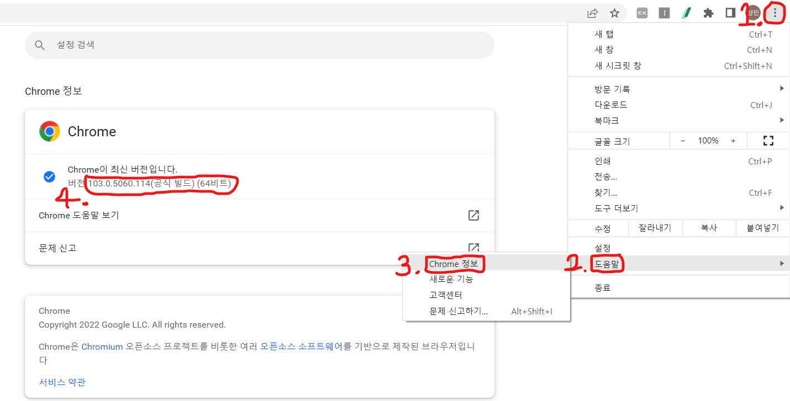
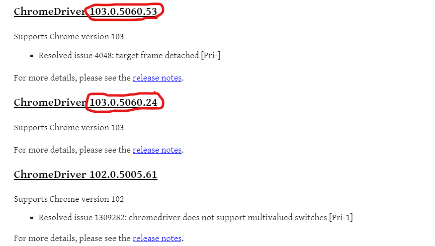
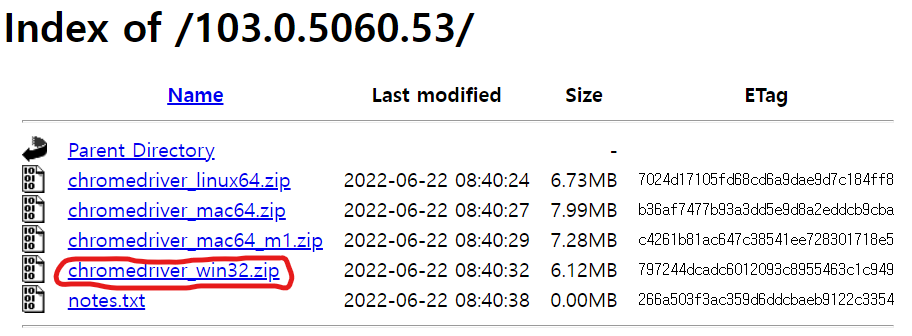
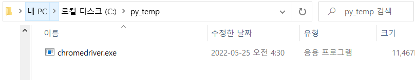
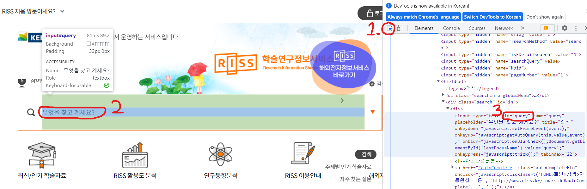
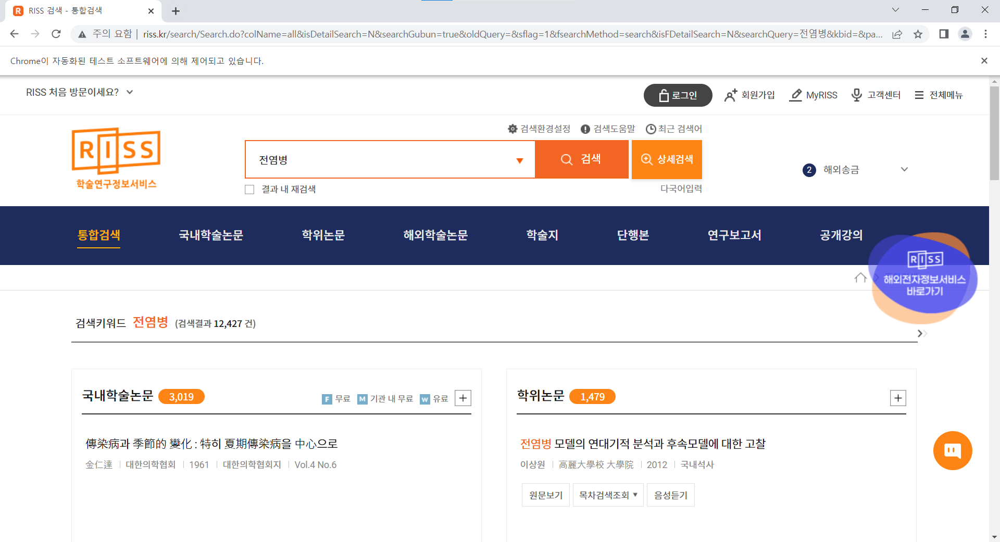

# 웹 크롤링

## Chap 1. Selenium 설치 및 예제

### 1. 웹크롤링의 원리


그림설명

1. 사람이 Selenium에게 특정 웹 페이지를 크롤링하라고 명령한다.
2. Selenium은 소스코드에 지정된 Web Driver를 실행하여 웹 페이지에 접속한다.
3. 접속한 웹 페이지를 HTML 소스코드 형태로 현재 크롤링을 실행하는 컴퓨터로 가져온다.
4. 수집된 HTML 전체 코드에서 Beautiful Soup를 사용하여 원하는 부분만 골라낸다.
5. 골라낸 데이터를 원하는 형식의 파일로 저장한다.

즉 크롤링을 하기 위해선 Selenium, Web Driver, Beautiful Soup 서로 어떤 역할을 하고 어떤 관계가 있는지를 연계해서 이해해야 한다.

### 2. 웹 크롤링을 위한 설정

#### 1) Selenium 패키지 설치  

```python
!pip install selenium==4.1.5 #주피터 노트북에서 설치를 진행하였습니다.
```

Selenium의 최근버전은 변경된 문법을 써야하기 때문에 구 문법, 신 문법을 모두 사용가능한 4.1.5버전을 이용합니다.

!pip list로 버전확인이 가능합니다.

#### 2) Web Driver 설치

웹 데이터를 크롤링 할 때 사람 대신 selenium이 우리가 지금 설치하는 웹 드라이버 프로그램을 이용해서 웹 페이지를 열고 사람이 지정한 태그를 찾아서 데이터를 수집합니다.

* Step 1. https://chromedriver.chromium.org/downloads 페이지를 엽니다.  
    (www.google.co.kr에서 chromedriver download로 검색해도 됩니다.)

* Step 2. 현재 컴퓨터에 설치된 크롬 버전 확인합니다.



    버전의 XXX.X와 같은 버전의 웹드라이버를 설치합니다.



    저는 103.0 버전이기에 103.0.5060.53을 다운로드하였습니다.  
    XXX.X 까지만 같아도 되니 같은 버전이 여러개이면 아무거나 다운받아도 무방합니다.

* Step 3. 윈도우용 chromedriver_win32.zip 다운로드 및 압축풀기



    mac이신 분들은 mac으로 다운받아야 합니다.

* Step 4. 파일 위치 변경 (선택)



    크롬드라이버의 위치가 Selenium 실행시 경로로 지정해줘야 합니다. 따라서 저는 코드를 간결하게 하기 위해 C드라이브 py_temp위치에 저장하였습니다.

### 3. 자동 검색하기 기능 구현

* 실습 예제입니다. Selenium을 사용하여 자동 검색기능을 구현해 보겠습니다.

        1. 웹 페이지를 열어라 (http://www.riss.kr)
        2. 검색창을 찾아라
        3. 검색어를 입력해라 (전염병)
        4. 조회해라

* 검색을 하기 위해선 검색칸의 id 속성값이 필요합니다.



    1번을 누르고 2번위에 커서를 올리면 id의 속성값을 확인할 수 있습니다.  
    이는 곧 Selenium에서 검색값을 입력하는 입력칸의 위치가 됩니다.


```python
# riss.kr 에서 특정 키워드로 논문 / 학술 자료 검색하기

#Step 1. 필요한 모듈을 로딩합니다
from selenium import webdriver
import time          

#Step 2. 사용자에게 검색 관련 정보들을 입력 받습니다.
print("=" *100)
print(" 이 크롤러는 RISS 사이트의 논문 및 학술자료 수집용 웹크롤러입니다.")
print("=" *100)
query_txt = input('1.수집할 자료의 키워드는 무엇입니까?(여러개일 경우 , 로 구분하여 입력): ')
#query_txt = '전염병'
print("\n")

#Step 3. 크롬 드라이버 설정 및 웹 페이지 열기
chrome_path = "C:/py_temp/chromedriver.exe"
driver = webdriver.Chrome(chrome_path)


url = 'http://www.riss.kr/'
driver.get(url)
time.sleep(2) #사이트 로딩되는 시간동안 멈추기

#Step 4. 자동으로 검색어 입력 후 조회하기
element = driver.find_element_by_id("query")
driver.find_element_by_id("query").click( )
element.send_keys(query_txt)
element.send_keys("\n")
```

    ====================================================================================================
     이 크롤러는 RISS 사이트의 논문 및 학술자료 수집용 웹크롤러입니다.
    ====================================================================================================
    1.수집할 자료의 키워드는 무엇입니까?(여러개일 경우 , 로 구분하여 입력): 전염병
    
    
    

    C:\Users\HONGSU~1\AppData\Local\Temp/ipykernel_16224/2475655519.py:17: DeprecationWarning: executable_path has been deprecated, please pass in a Service object
      driver = webdriver.Chrome(chrome_path)
    C:\Users\HONGSU~1\AppData\Local\Temp/ipykernel_16224/2475655519.py:25: DeprecationWarning: find_element_by_* commands are deprecated. Please use find_element() instead
      element = driver.find_element_by_id("query")
    C:\Users\HONGSU~1\AppData\Local\Temp/ipykernel_16224/2475655519.py:26: DeprecationWarning: find_element_by_* commands are deprecated. Please use find_element() instead
      driver.find_element_by_id("query").click( )
    



    결과물이 잘 출력되는 것을 확인할 수 있습니다.

## Chap 2. Beautiful Soup로 원하는 값 추출 후 저장하기

### 1. Beautiful Soup 역할과 설치하기

* Beautiful Soup는 아주 복잡한 HTML 코드에서 지정된 특정 태그나 값을 추출할 때 사용하는 라이브러리입니다.

* 설치
```python
!pip install bs4
```

### 2. Beautiful Soup를 사용하여 데이터 추출하기

* 주요 함수
    * find() 함수 - 주어진 조건을 만족하는 첫 번째 태그 값만 가져옵니다.
    * find_all() 함수 - 해당 태그가 여러 개 있을 경우 한꺼번에 모두 가져옵니다.
    * select( ) 함수 - 더 다양한 조건으로, 더 직관적인 방법으로 태그를 쫓을 수 있다.

find() 함수 예제


```python
#Beautiful Soup 예제 1
from bs4 import BeautifulSoup
ex1 = '''
<html>
    <head>
        <title> HTML 연습 </title>
    </head>
    <body>
        <p align="center"> text 1 </p>
        
    </body>
<html> '''

soup = BeautifulSoup(ex1, 'html.parser')
print( soup.find('title') )
print( soup.find('p') )
```

    <title> HTML 연습 </title>
    <p align="center"> text 1 </p>
    

find_all() 함수 예제


```python
#Beautiful Soup 예제 2
from bs4 import BeautifulSoup
ex1 = '''
<html>
    <head>
        <title> HTML 연습 </title>
    </head>
    <body>
        <p align="center"> text 1 </p>
        <p align="center"> text 2 </p>
        <p align="center"> text 3 </p>
        
    </body>
<html> '''

soup = BeautifulSoup(ex1, 'html.parser')
print( 'find_all() 함수 :' ,soup.find_all('p') )
print('*'* 50)
print( '첫번째 find_all() 함수 :' ,soup.find_all('p')[0] )
print( '두번째 find_all() 함수 :' ,soup.find_all('p')[1] )
print( '세번째 find_all() 함수 :' ,soup.find_all('p')[2] )
```

    find_all() 함수 : [<p align="center"> text 1 </p>, <p align="center"> text 2 </p>, <p align="center"> text 3 </p>]
    **************************************************
    첫번째 find_all() 함수 : <p align="center"> text 1 </p>
    두번째 find_all() 함수 : <p align="center"> text 2 </p>
    세번째 find_all() 함수 : <p align="center"> text 3 </p>
    

select() 함수 예제


```python
# 연습용 html 만들기
ex2='''
<html>
    <head>
        <h1> 사야할 과일
    </head>
    <body>
        <h1> 시장가서 사야할 과일 목록
            <div><p id='fruit1' class='name1' title='바나나'> 바나나
                <span class='price'> 3000원 </span>
                <span class='count'> 10개 </span>
                <span class='store'> 바나나가게 </span>
                <a href='https://www.banana.com'> banana.com </a>
                </p>
            </div>
             <div><p id='fruit2' class='name2' title='체리'> 체리
                <span class='price'> 100원 </span>
                <span class='count'> 50개 </span>
                <span class='store'> 체리가게 </span>
                <a href='https://www.cherry.com'> cherry.com </a>
                </p>
            </div>
             <div><p id='fruit3' class='name3' title='오렌지'> 오렌지
                <span class='price'> 500원 </span>
                <span class='count'> 20개 </span>
                <span class='store'> 오렌지가게 </span>
                <a href='https://www.orange.com'> banana.com </a>
                </p>
            </div>
        </body>
    </html> '''   
```


```python
# select('태그이름')
soup2 = BeautifulSoup(ex2 , 'html.parser')

soup2.select('p')#select(''.클래스이름')
soup2.select(' .name1 ')
```


    [<p class="name1" id="fruit1" title="바나나"> 바나나
                     <span class="price"> 3000원 </span>
     <span class="count"> 10개 </span>
     <span class="store"> 바나나가게 </span>
     <a href="https://www.banana.com"> banana.com </a>
     </p>]


```python
#select(''.클래스이름')
soup2.select(' .name1 ')
```


    [<p class="name1" id="fruit1" title="바나나"> 바나나
                     <span class="price"> 3000원 </span>
     <span class="count"> 10개 </span>
     <span class="store"> 바나나가게 </span>
     <a href="https://www.banana.com"> banana.com </a>
     </p>]


```python
#select(‘ 상위태그 > 하위태그 > 하위태그‘ )
soup2.select(' div > p > span')
```


    [<span class="price"> 3000원 </span>,
     <span class="count"> 10개 </span>,
     <span class="store"> 바나나가게 </span>,
     <span class="price"> 100원 </span>,
     <span class="count"> 50개 </span>,
     <span class="store"> 체리가게 </span>,
     <span class="price"> 500원 </span>,
     <span class="count"> 20개 </span>,
     <span class="store"> 오렌지가게 </span>]


```python
#select(‘ 상위태그 > 하위태그 > 하위태그‘ )
soup2.select(' div > p > span')[0]
```


    <span class="price"> 3000원 </span>


```python
#select(‘ 상위태그 > 하위태그 > 하위태그‘ )
soup2.select(' div > p > span')[1]
```


    <span class="count"> 10개 </span>


```python
# select(‘상위태그.클래스이름 > 하위태그.클래스이름’)
soup2.select(' p.name1 > span.store ')
```


    [<span class="store"> 바나나가게 </span>]


# Chapter 2.5 : Selenium, bs4 복합사용

* Selenium이랑 Beautiful4를 복합적으로 사용하여 원하는 내용을 크롤링 해보겠습니다.  

    1. https://www.riss.kr/ 에서 전염병 입력
    2. 학위 논문 선택
    3. 본문내용 출력하기


```python
#Chap 13. riss.kr 사이트에서 특정 키워드로 자동 검색하기

#Step 1. 필요한 모듈을 로딩합니다
from selenium import webdriver
from selenium.webdriver.common.by import By
from selenium.webdriver.common.keys import Keys
from selenium.webdriver.chrome.service import Service
import time          

#Step 2. 사용자에게 검색 관련 정보들을 입력 받습니다.
print("=" *100)
print(" 이 크롤러는 riss 사이트의 논문 자료 수집용 웹크롤러입니다.")
print("=" *100)
query_txt = input('1.수집할 자료의 키워드는 무엇입니까?(예: 전염병): ')
print("\n")

#Step 3. 크롬 드라이버 설정 및 웹 페이지 열기
s = Service("C:/py_temp/chromedriver.exe")
driver = webdriver.Chrome(service=s)

url = 'https://www.riss.kr/'
driver.get(url)
time.sleep(2)
driver.maximize_window()

#Step 4. 자동으로 검색어 입력 후 조회하기
element = driver.find_element(By.ID,'query')
driver.find_element(By.ID,'query').click( )
element.send_keys(query_txt)
element.send_keys("\n")

#Step 5.학위 논문 선택하기
driver.find_element(By.LINK_TEXT,'학위논문').click()
time.sleep(2)
```

    ====================================================================================================
     이 크롤러는 riss 사이트의 논문 자료 수집용 웹크롤러입니다.
    ====================================================================================================
    1.수집할 자료의 키워드는 무엇입니까?(예: 전염병): 전염병
    
    
    


```python
#Step 6.Beautiful Soup 로 본문 내용만 추출하기
from bs4 import BeautifulSoup
html_1 = driver.page_source #현재 페이지의 전체 소스코드를 다 가져오기
soup_1 = BeautifulSoup(html_1, 'html.parser')

content_1 = soup_1.find('div','srchResultListW').find('li')
print(content_1.get_text().replace("\n"," ").strip())
```

    1   전염병 모델의 연대기적 분석과 후속모델에 대한 고찰  이상원 高麗大學校 大學院 2012 국내석사  RANK : 27772927    원문보기 목차검색조회  음성듣기             전염병은 고대 시대부터 줄곧 인간을 위협해왔으며, 기원전 430년부터 428년에 발생한 아테네지역의 전염병이 Thucydides에 의해 보고된 이후, 전 세계적으로 많은 사망자를 발생하게 한 전염병들이 다수의 생물학자들에 의해 분석되어 졌다. 전염병에 대한 연구가 2차 세계대전 이전에는 단순히 전염병을 관찰하는데 그친 반면, 2차 대전이후에는 전염병을 무기화 하고 그것을 어떻게 통제할 것인지에 초점이 맞춰지기 시작하였다. 또한 페니실린에 발견으로 이러한 질병을 통제하는 방법이 다변화되었으며, Bernoulli가 천연두의 확산에 대해 우두접종의 긍정적인 효과를 보고 한 후, Kermack-McKendrick에 의해 수학에 기초를 둔 모델링이 시작되었다. 이는 생물학적인 분석에 수학적인 사고를 접목하여, 전염병을 좀 더 체계적으로 분석하고자 하는 시도로 볼 수 있다.   Anderson-May는 좀 더 이러한 연구들을 발전시켰으며, 현재 많은 연구자들에 의해 새로운 발생하는 전염병들에 대해 연구가 이루어지고 있다. 특히, 상미분방정식과 편미분방정식을 도구로 하여 여러 가지 형태의 전염병 모델을 발전시킴으로써 전염병을 효과적으로 통제할 수 있는 연구가 활발히 진행되어 지고 있다.  그동안 많은 연구에서 전염병을 통제하는데 가장 중요한 요소는 전염병 전파에 의해 영향 받지 않는 점(Disease free equilibrium : DFE)에 대한 의 값으로서, 그 값이  보다 크거나 혹은 작은 경우에 따라 전염병의 통제 여부를 판단하여 왔으나, 최근에는 통제 재생산률(Control reproduction rate : 모델링에서 각종 통제 변수들에 의해 변동되어지는 질병이 전파되는 비율)라는 값이 전염병을 통제하는 새로운 요소로 연구되어 지고 있다.     본 논문에서는 지금까지 발전되어온 수많은 논문들에서 큰 틀을 이루고 있는 전염병에 대한 모델들을 연대기적으로 나열하고 분석함으로써, 기존의 모델에서 중요한 변수를 설정하는 방법을 고찰하고, 향후 고려할 수 있는 발전된 모델들에 대해 예측해 본다.
    

잘 출력되었음을 확인할 수 있습니다.
